# Buyback End-to-End Flowchart: A4 Print Parts

This version divides the buyback lifecycle into twenty narrow Mermaid diagrams. Each part is designed to stay in a single reading pane, avoid left-right scrolling, and print cleanly on one A4 page.

The numbering is hierarchical. Part 1 uses steps 1.1, 1.2, 1.3, and so on; Part 2 uses 2.1, 2.2, 2.3; and the pattern continues through the process.

Each Mermaid block uses larger font settings and short wrapped node labels.

Suggested print settings: A4, portrait orientation, default margins, and scale around 90-100%.

## Part 1: Loan Creation

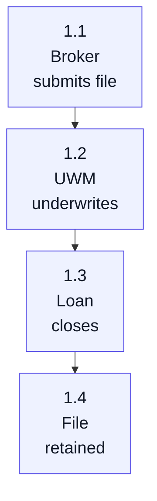

What it means: the evidence trail begins before the loan is sold.

## Part 2: Sale and Contractual Risk

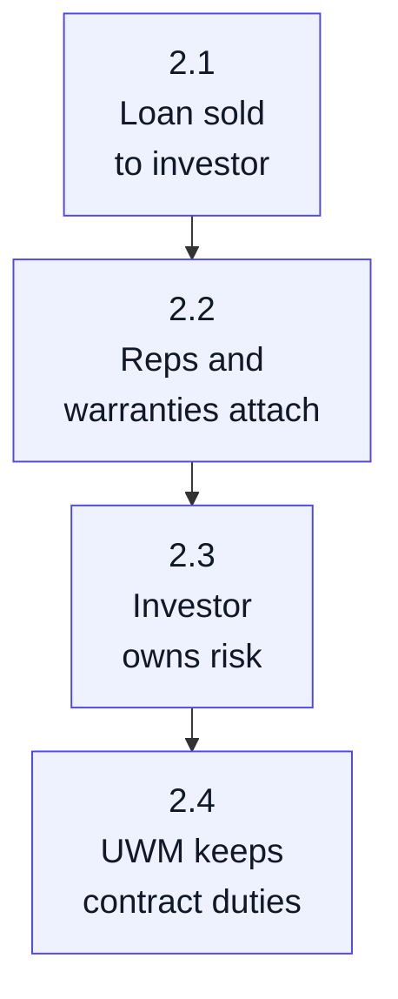

What it means: selling the loan does not eliminate UWM's repurchase obligations.

## Part 3: Post-Sale Monitoring

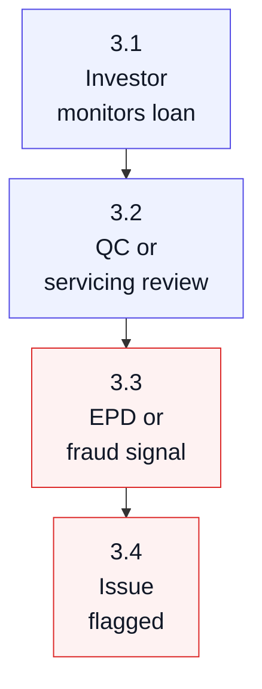

What it means: a demand often starts with monitoring after sale, not with a closing-day event.

## Part 4: Defect Review

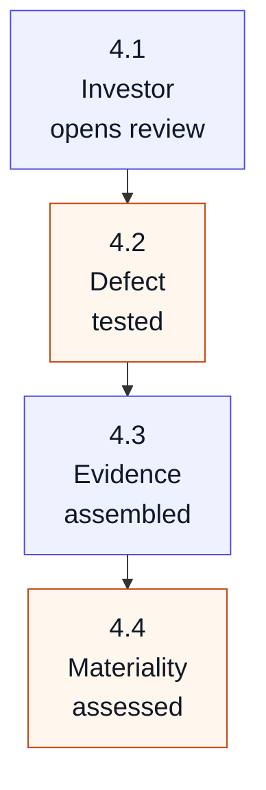

What it means: not every defect becomes a demand; the investor decides whether it is material.

## Part 5: Demand Notice

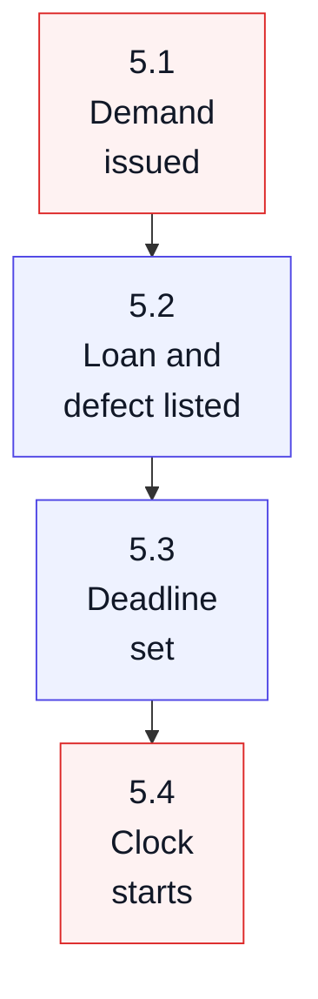

What it means: the demand letter defines the response window and the alleged breach.

## Part 6: Intake and Ownership

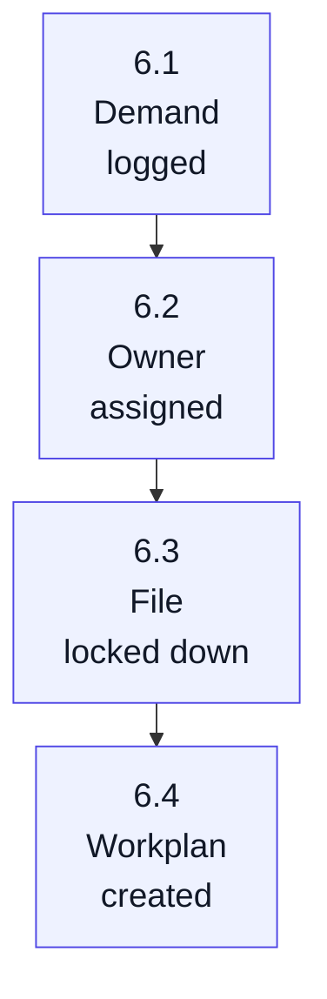

What it means: intake control keeps the response organized and preserves the audit trail.

## Part 7: Evidence Pull

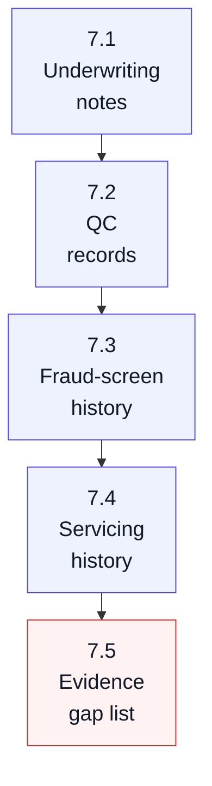

What it means: a strong response depends on finding the exact support for the original decision.

## Part 8: Strategy Triage

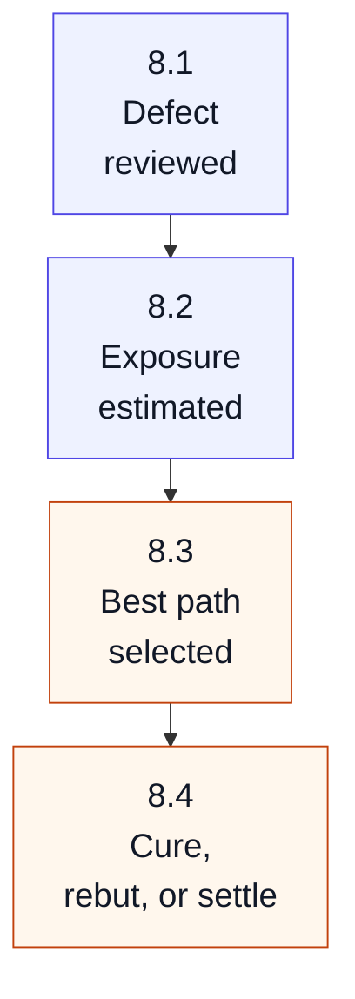

What it means: triage decides whether UWM should cure, rebut, negotiate, or prepare for repurchase.

## Part 9: Cure Path

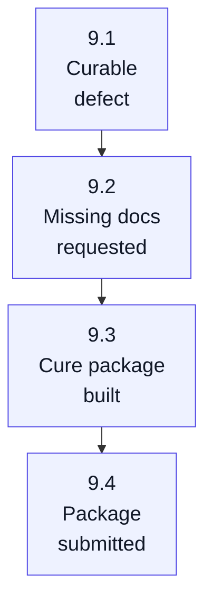

What it means: cure tries to fix the defect without repurchase.

## Part 10: Cure Decision

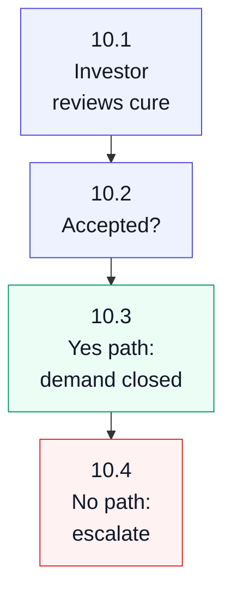

What it means: rejection does not always mean immediate repurchase; the file may move to rebuttal or negotiation.

## Part 11: Rebuttal Path

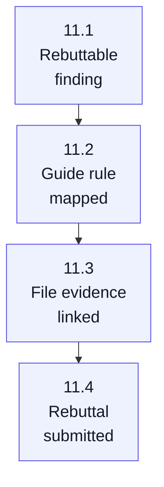

What it means: rebuttal argues that the investor finding is incorrect or not material under the rules.

## Part 12: Rebuttal Decision

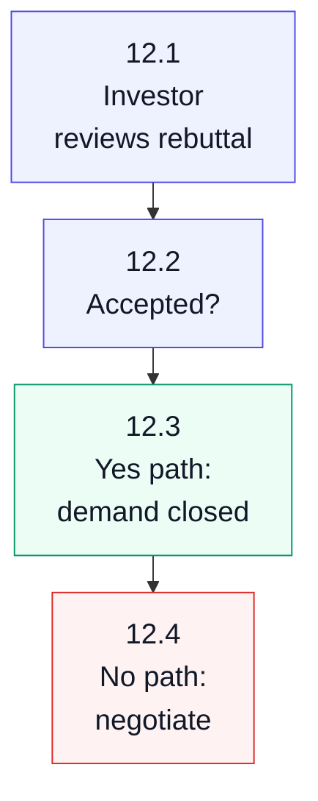

What it means: if rebuttal fails, UWM evaluates settlement alternatives before full repurchase.

## Part 13: Negotiated Alternatives

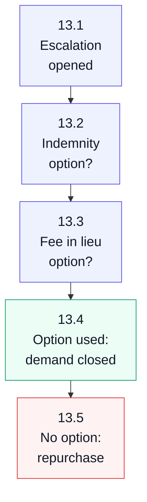

What it means: negotiated alternatives may avoid immediate repurchase but can preserve future exposure.

## Part 14: Repurchase Price

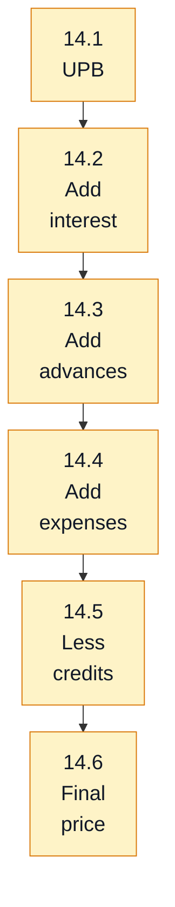

What it means: the repurchase price is contractual, not a current market value.

## Part 15: Settlement and Transfer

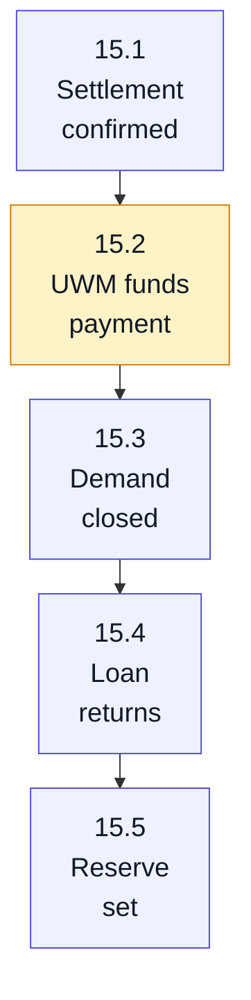

What it means: settlement moves the loan back onto UWM's books if applicable.

## Part 16: Workout Assignment

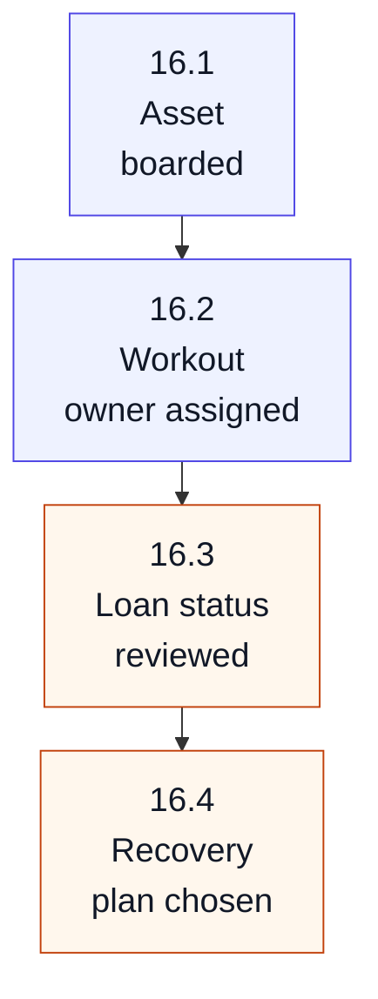

What it means: after repurchase, the next job is managing recovery and limiting final loss.

## Part 17: Recovery Paths

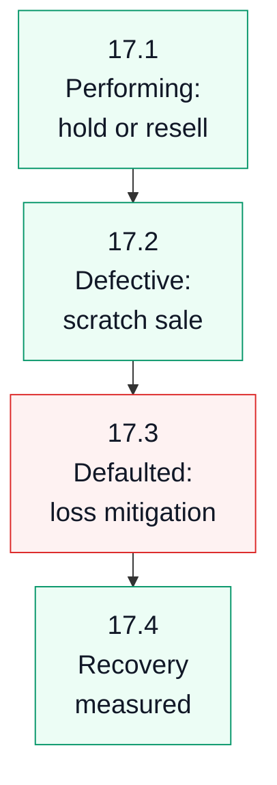

What it means: recovery depends on whether the loan is performing, saleable, or defaulted.

## Part 18: Recourse and Insurance

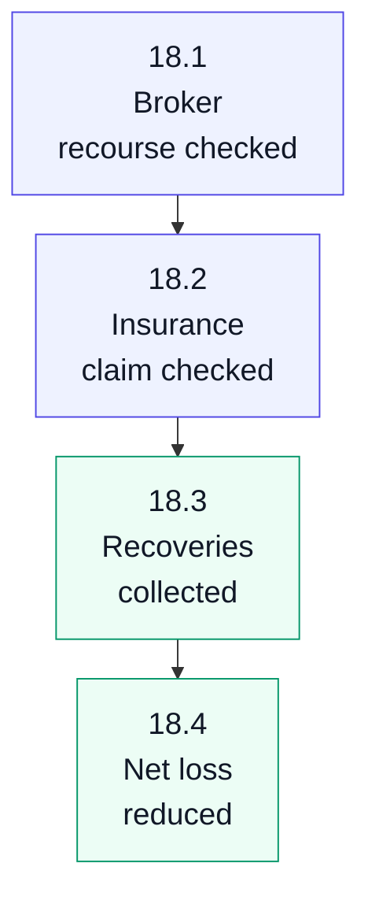

What it means: third-party recovery can materially reduce UWM's final loss.

## Part 19: Loss Finalization

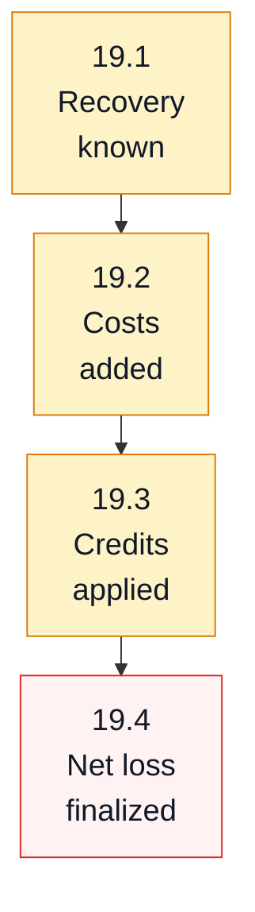

What it means: final severity is the repurchase cost minus recoveries, plus carrying and workout costs.

## Part 20: Prevention Loop

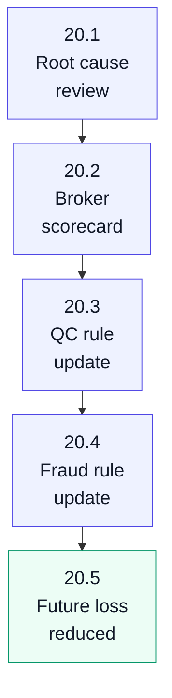

What it means: the buyback process should feed directly into better prevention, lower demand frequency, and lower loss severity.
