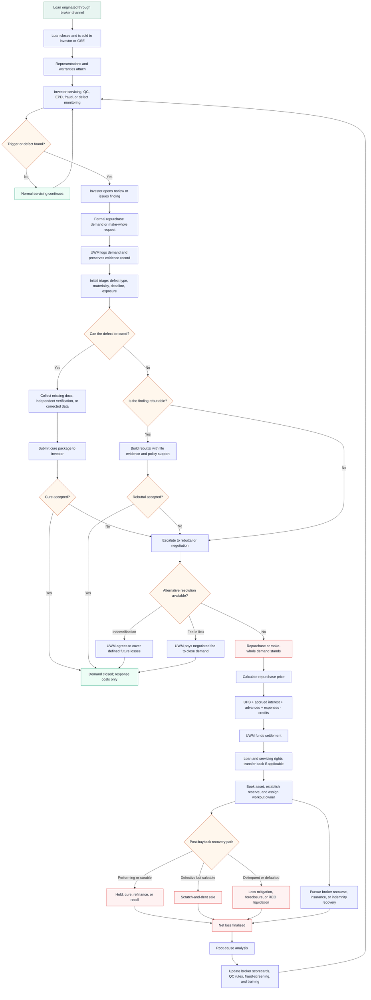

# Buyback End-to-End Flowchart

This Mermaid flowchart shows the full buyback lifecycle from loan sale through investor demand, cure/rebuttal, repurchase, recovery, and upstream control improvements.

## How to Read It

- The left side of the process starts before any demand: origination, sale, reps and warranties, and post-sale monitoring.
- The middle is the response window: triage, cure, rebuttal, negotiation, indemnification, fee in lieu, or full repurchase.
- The bottom is economic recovery: disposition of the loan, broker or insurance recovery, final loss measurement, and root-cause feedback.
- The loop back into monitoring represents prevention: each buyback should improve upstream QC, broker management, and fraud-screening discipline.
