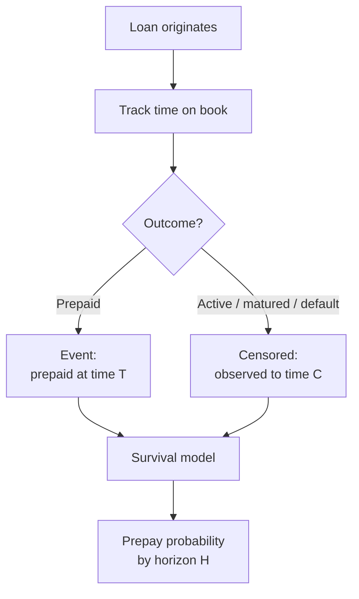

# Big Picture: What You Were Being Advised

This is a plain-language summary of [[01_model_ideas]]. The core advice is not "pick a fancier algorithm" — it is **reframe the problem** so your data and business question actually match.

---

## The situation

You have roughly **2 million loans over 10 years**, and **fewer than 1% prepay**. That sounds like a classic imbalanced classification problem — but the advice says that framing is misleading.

The real complication is **right-censoring**:

- Many loans are still active.
- Many have not had enough time to prepay yet.
- You cannot honestly label them "will never prepay."

So the hard part is not just rarity. It is **incomplete information over time**.

---

## The main recommendation: think in time, not yes/no

Instead of asking:

> Will this loan ever prepay?

Ask:

> **When** is this loan likely to prepay, and what is the probability it prepays by month 12, 24, 36, etc.?

That is **survival analysis** (time-to-event modeling). You model how prepayment risk evolves as a loan ages, then convert that into whatever probability your business needs.

**Why this matters for you:**

| Problem with binary classification | What survival analysis does instead |
|---|---|
| Throws away timing | Uses *when* prepayments happen |
| Recent loans look like negatives | Recent loans still contribute information up to today |
| Wastes most of the 2M rows | Uses all loans, including censored ones |
| Ignores "seasoning" (risk changes with loan age) | Captures age effects naturally |

---

## What you were told to build (in order)

### 1. Get the target definition right

Before modeling, nail down:

- What exactly counts as **prepayment** (full payoff only? partial payments?)
- What ends observation: maturity, default, portfolio exit, data cutoff
- Whether default competes with prepayment

Each loan needs:

- **Duration** — time from origination to prepayment or censoring
- **Event flag** — prepaid or not

### 2. Explore the data properly

Start with Kaplan–Meier curves: overall and by segments (credit score, LTV, rate spread, vintage). This answers "what does prepayment behavior look like at all?" before you fit anything complex.

Split data **by time** (train on older originations, test on newer ones). That mimics real production use and avoids cheating with future information.

### 3. Model progression: simple → powerful

| Stage | Method | Role |
|---|---|---|
| Start here | **Cox Proportional Hazards** | Fast, interpretable baseline; industry-standard for lending |
| Next | **ML survival models** (Random Survival Forest, boosted survival) | Better nonlinear patterns, more features |
| Flexible alternative | **Discrete-time hazard model** (LightGBM/XGBoost per period) | Very practical in credit; handles time-varying rates/macros |

For a **new loan at origination**, feed in its features and get a prepayment probability curve — or a single number for whatever horizon the business cares about (e.g. 24-month prepay probability).

### 4. Handle rarity the right way

You do **not** need to throw away data or rely mainly on SMOTE.

Survival methods are built for this:

- Censored loans still teach the model "no prepay *yet*"
- Cox focuses learning on actual event times
- Tree/boosting models can use class weights

The advice: proper survival framing + weights beats aggressive resampling on 2M rows.

### 5. Evaluate probabilities, not accuracy

Accuracy is nearly useless here. Focus on:

- **Ranking quality** (C-index)
- **Probability quality** (Brier score, calibration plots)
- **Imbalance-aware performance** (PR-AUC)

Then **calibrate** outputs so "10% predicted prepay" really means ~10% in reality. That matters if anyone uses the score for capital, pricing, or risk decisions.

### 6. Plan for production reality

Prepayment is **macro-sensitive** (especially refinancing incentive when market rates move). Models need:

- Clear assumptions about future rates/economy (scenarios or static proxies)
- Time-based validation
- Drift monitoring
- Interpretability for risk/regulatory audiences (hazard ratios, SHAP, etc.)

---

## The fallback option (if survival feels too heavy at first)

You *can* do binary classification, but only on a **filtered subset**:

- Pick a fixed horizon $H$ (e.g. 24 months)
- Keep only loans old enough to be fully observed over $H$
- Label prepaid within $H$ vs not

Use gradient boosting with class weights, calibrate, and measure PR-AUC.

**Tradeoff:** simpler to explain, but you lose data, lose timing detail, and bias against recent loans. The advice treats this as a stepping stone — not the end state.

---

## The practical roadmap you were given

1. Align with stakeholders on definition, horizon, and loan type
2. EDA with Kaplan–Meier curves and event counts by vintage/segment
3. Prototype **Cox PH** in `lifelines` (quick, interpretable win)
4. Compare against **LightGBM discrete-time** or **Random Survival Forest**
5. Iterate on features — especially **rate incentive** (market rate minus note rate) and macro context
6. If events are still impossibly rare after cleaning definitions, check data quality or downgrade to a **risk tier/score** instead of a precise probability

---

## One-sentence takeaway

**You were being told to predict prepayment as a time-to-event survival problem — not a rare yes/no classification — because most of your "non-prepayers" are simply loans you have not finished observing yet, and survival methods turn that incomplete history into usable, calibrated prepayment probabilities for new loans.**