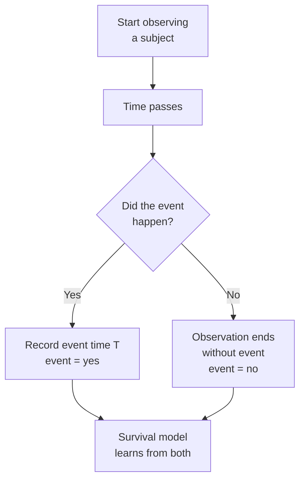
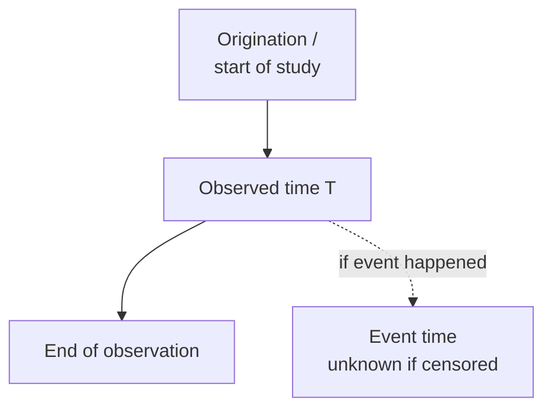
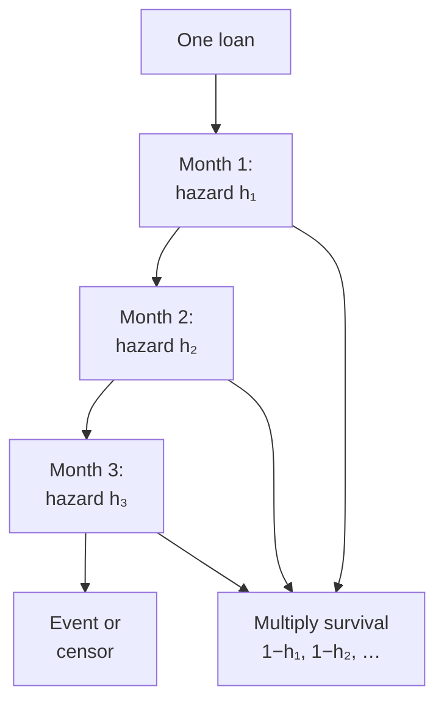
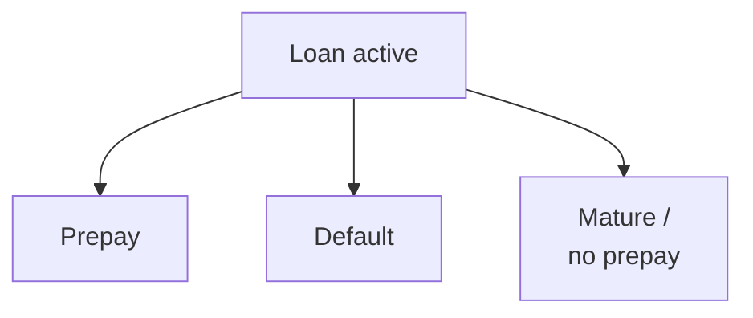
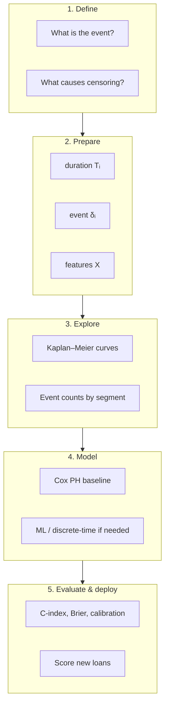

# Survival Models: Fundamentals

A self-contained primer on survival analysis (time-to-event modeling). Read this before [[../epo_101/02_big_picture]] and [[../epo_101/01_model_ideas]] if prepayment modeling is your end goal.

---

## What is a survival model?

A **survival model** predicts **how long until something happens** — or more precisely, **how the probability of that event changes over time**.

Classic examples:

- Time until a patient dies or relapses (medicine)
- Time until a machine fails (reliability)
- Time until a customer churns (subscription businesses)
- Time until a loan prepays (lending)

The name comes from medicine ("survival" = staying alive), but the methods apply to **any** event you care about.



---

## Why not use regular classification or regression?

| Approach | What it asks | Problem for time-to-event data |
|---|---|---|
| **Binary classification** | Will the event ever happen? | Ignores *when*; recent subjects look like negatives |
| **Linear regression** | Predict time as a number | Times are skewed; censored cases have no true time |
| **Survival analysis** | What is the risk *at each moment*, given survival so far? | Built for partial observation |

The killer issue is **censoring** (explained below). Most of your data is incomplete — not because it is missing, but because observation stopped before the event occurred.

---

## Core vocabulary

Every survival problem needs the same building blocks.

### 1. Event

The outcome you are modeling.

- Death, relapse, churn, **prepayment**, default, etc.
- Must be defined precisely (e.g. full loan payoff vs partial curtailment).

### 2. Time / duration

How long from a defined **start** until the event or until observation ends.

- Start: loan origination, diagnosis date, subscription signup
- Duration $T_i$: observed time for subject $i$

### 3. Event indicator $\delta_i$

$$
\delta_i =
\begin{cases}
1 & \text{event observed for subject } i \\
0 & \text{censored — observed without event}
\end{cases}
$$

In code this is often a column called `event` (1 = yes, 0 = no).

### 4. Censoring

**Censoring** means you know the subject survived *at least* up to time $T_i$, but you do not know what happened after.



**Right-censoring** (most common in lending): observation ends before the event.

Examples:

- Loan is still active at data cutoff
- Loan matures without prepaying
- Borrower defaults (if you treat default as censoring for prepay)
- Patient leaves the study alive

**Why censoring is informative, not junk data:** a loan active for 8 years without prepaying tells you it did *not* prepay in years 1–8. Binary classification often throws that away.

### 5. Survival function $S(t)$

Probability of **not** having had the event by time $t$:

$$
S(t) = P(T > t)
$$

- $S(0) = 1$ (everyone has "survived" at the start)
- $S(t)$ decreases (or stays flat) as $t$ increases
- $S(\infty) \to 0$ if everyone eventually experiences the event

**Prepayment probability by horizon $H$:**

$$
P(\text{prepay by } H) = 1 - S(H)
$$

### 6. Hazard function $h(t)$

The **instantaneous risk** of the event at time $t$, given survival up to $t$:

$$
h(t) = \lim_{\Delta t \to 0} \frac{P(t \leq T < t + \Delta t \mid T \geq t)}{\Delta t}
$$

Intuition: "Among loans still active at month 36, what fraction prepay in the next instant?"

- High hazard → event likely soon
- Zero hazard → event impossible at that moment

**Relationship between hazard and survival:**

$$
S(t) = \exp\!\left(-\int_0^t h(u)\,du\right)
$$

You can go from hazard → survival → cumulative event probability.

### 7. Covariates / features $X$

Characteristics that shift risk: credit score, LTV, rate spread, loan age, macro rates, etc.

Conditional survival: $S(t \mid X)$ — survival for someone with features $X$.

---

## The data shape

Each row is one subject (one loan, one patient, one customer).

| loan_id | duration | event | credit_score | ltv | rate_spread |
|---|---|---|---|---|---|
| 001 | 48 | 1 | 720 | 0.80 | 1.2 |
| 002 | 36 | 0 | 680 | 0.90 | 0.5 |
| 003 | 120 | 0 | 750 | 0.70 | 2.0 |

- `duration` = $T_i$ (months on book until prepay or censor)
- `event` = $\delta_i$ (1 = prepaid, 0 = censored)

That is all a basic survival model needs. Features are optional but almost always used.

---

## Model families (what people actually use)

### Level 0: Kaplan–Meier (non-parametric baseline)

**No features.** Estimates the overall survival curve from data alone.

- Great for EDA: "What does prepayment look like in the portfolio?"
- Stratify by segments (LTV buckets, vintages) to compare curves
- Cannot score new loans with different features (no $X$)

Think of it as the survival version of a histogram / empirical CDF.

---

### Level 1: Cox Proportional Hazards (Cox PH)

The workhorse model in industry and academia.

$$
h(t \mid X) = h_0(t)\,\exp(\beta^\top X)
$$

| Term | Meaning |
|---|---|
| $h_0(t)$ | Baseline hazard — captures how risk changes with time (seasoning) |
| $\exp(\beta^\top X)$ | Multiplicative shift from features |
| $\exp(\beta_j)$ | Hazard ratio for feature $j$ |

**Example:** $\exp(\beta_{\text{rate spread}}) = 1.5$ means a 1-unit higher spread → 50% higher instantaneous prepay risk at any age (if proportional hazards holds).

**Pros:** Interpretable, fast, well-understood, handles censoring natively

**Cons:** Assumes proportional hazards (risk ratios constant over time); linear in log-hazard

**Python:** `lifelines.CoxPHFitter`

---

### Level 2: Parametric survival models

Assume $T$ follows a known distribution (Weibull, log-normal, exponential, etc.).

$$
T \sim \text{Weibull}(\lambda, k)
$$

**Pros:** Full distribution of survival time; can be more efficient with small data

**Cons:** Wrong distributional assumption → biased estimates

**Python:** `lifelines` parametric fitters (Weibull, LogNormal, etc.)

---

### Level 3: Discrete-time hazard models

Split continuous time into intervals (months, quarters). For each interval $s$, model:

$$
P(\text{event in interval } s \mid \text{survived to } s-1, X)
$$

Use any classifier: logistic regression, LightGBM, XGBoost, neural net.

**Cumulative prepay probability:**

$$
P(\text{prepay by } t \mid X) = 1 - \prod_{s=1}^{t} \bigl(1 - h(s \mid X)\bigr)
$$

**Pros:** Very flexible; easy to add time-varying features (rate incentive each month); familiar ML tooling

**Cons:** Data expands (one row per loan per period) — memory cost at scale



---

### Level 4: Machine learning survival models

Tree and neural methods that relax assumptions.

| Model | Idea |
|---|---|
| **Random Survival Forest** | Ensemble of survival trees; captures nonlinear interactions |
| **Gradient Boosted Survival** | Boosted trees on concordance / survival loss |
| **DeepSurv / neural survival** | Neural net hazard model |

**Pros:** Complex patterns, many features, nonlinear effects

**Cons:** Harder to interpret; often need calibration; more tuning

**Python:** `scikit-survival`, `pysurvival`

---

## Competing risks (when multiple things can happen)

A loan might **prepay**, **default**, or **mature** — only one "wins."



Options:

- **Cause-specific hazard:** model prepay while treating default/maturity as censoring
- **Fine-Gray subdistribution:** model cumulative incidence of prepay accounting for competition
- **Multi-state models:** transition between states

Choice depends on the business question: "prepay risk *given* survival" vs "overall prepay incidence in the portfolio."

---

## How to evaluate survival models

**Do not use accuracy.** Most subjects are censored; accuracy is misleading.

| Metric | What it measures |
|---|---|
| **C-index (concordance)** | Ranking: do higher-risk subjects event earlier? (Like AUC for survival) |
| **Brier score** | Error in predicted probability at a given time |
| **Integrated Brier score (IBS)** | Brier averaged over multiple horizons |
| **Time-dependent AUC / PR** | Discrimination at specific time points |
| **Calibration plots** | Does predicted 10% ≈ observed 10%? |

Always validate on **held-out time periods** — train on older data, test on newer originations.

---

## From model to business output

For a **new loan** at origination ($t = 0$), with features $X$:

1. Fit survival model on historical loans
2. Predict $S(t \mid X)$ or $h(t \mid X)$ for that loan
3. Convert to business metric:

$$
P(\text{prepay within 24 months} \mid X) = 1 - S(24 \mid X)
$$

You can produce one number (24-month prepay probability) or a full curve (prepay probability by month).

```mermaid
flowchart TB
    H[Historical loans<br/>duration + event + features]
    M[Fit survival model]
    N[New loan features X]
    S[Survival curve S(t|X)]
    B[Business output<br/>e.g. 24-month prepay %]

    H --> M
    N --> M
    M --> S --> B
```

---

## Common pitfalls

| Pitfall | Why it hurts | Fix |
|---|---|---|
| Treating censored loans as "no event ever" | Biases risk downward; wastes data | Use survival methods |
| Random train/test split | Leakage; overstates performance | Time-based split |
| Ignoring loan age (seasoning) | Prepay risk is not constant over life | Let $h_0(t)$ or time intervals capture it |
| Using accuracy | Meaningless with <1% events | C-index, Brier, PR-AUC |
| Uncalibrated probabilities | Bad for capital / pricing decisions | Isotonic / Platt calibration |
| Wrong event definition | Model learns the wrong thing | Align with stakeholders first |

---

## Python toolbox (quick reference)

| Library | Best for |
|---|---|
| `lifelines` | Kaplan–Meier, Cox PH, parametric models, plotting |
| `scikit-survival` | Random Survival Forest, boosted survival, metrics |
| `pysurvival` | Additional models, credit-risk examples |
| `XGBoost` / `LightGBM` | Discrete-time hazard (person-period data) |

---

## Mental model: the whole pipeline



---

## How this connects to prepayment

Your lending problem is a textbook survival setup:

- **Event:** full prepayment before maturity
- **Censoring:** still active, matured without prepay, defaulted, data cutoff
- **Duration:** months from origination
- **Features:** rate spread, LTV, credit score, loan purpose, macros
- **Output:** $P(\text{prepay by } H \mid X)$ for business horizon $H$

The [[../epo_101/02_big_picture]] doc applies these ideas to your 2M-loan, <1% prepay portfolio. This file gives you the **why** and **how** underneath that advice.

---

## Suggested reading order

1. **This file** — concepts and vocabulary
2. [[../epo_101/02_big_picture]] — how it maps to your prepayment problem
3. [[../epo_101/01_model_ideas]] — detailed modeling pipeline and implementation notes

---

## Key formulas cheat sheet

| Concept | Formula |
|---|---|
| Survival function | $S(t) = P(T > t)$ |
| Event probability by $H$ | $1 - S(H)$ |
| Cox hazard | $h(t \mid X) = h_0(t)\exp(\beta^\top X)$ |
| Hazard → survival | $S(t) = \exp\!\left(-\int_0^t h(u)\,du\right)$ |
| Discrete-time cumulative | $P(\text{event by } t) = 1 - \prod_{s=1}^{t}(1 - h_s)$ |
| Event indicator | $\delta = 1$ event, $\delta = 0$ censored |

---

## One-sentence summary

**A survival model learns how event risk unfolds over time from subjects who either experienced the event or were only observed partway — then uses that to predict the probability of the event by any future horizon for new subjects.**