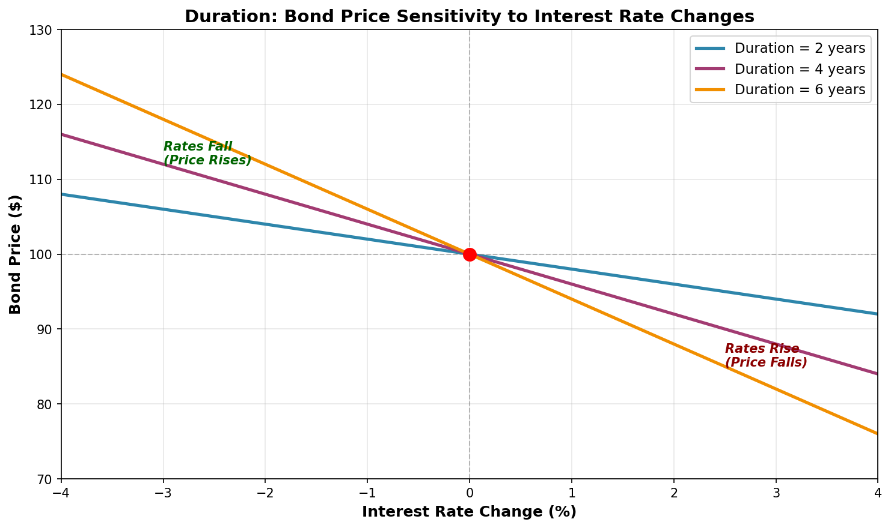

# Duration: Measuring Bond Price Sensitivity

## Explanation

Duration is a measure of how much a bond's price will change when interest rates move up or down. Think of it as the "weighted average time" until you get your money back from a bond. It's measured in years, but unlike the maturity date (which is just when you get your final payment), duration accounts for all the cash payments you receive along the way. Duration tells you the price sensitivity to rate changes: a bond with 5 years of duration will lose about 5% of its value if interest rates rise by 1%. For mortgage-backed securities, duration is more complex because it changes based on prepayment expectations—when rates fall, homeowners refinance faster, shortening the duration; when rates rise, prepayments slow down, lengthening it.

## Real-World Mortgage Example

Imagine you bought a mortgage-backed security backed by 500 mortgages with a 4% coupon in 2023. The MBS's stated maturity is 30 years, but because homeowners make monthly payments and some refinance early, you expect to get your money back in about 5-7 years on average. The duration might be 4.5 years. Now, if interest rates rise to 5% (a 1% increase), the price of your MBS would drop by roughly 4.5%. If you paid $100,000 for the security, it's now worth about $95,500. Conversely, if rates fall, the price would appreciate, but less than you'd expect because faster refinancing shortens the duration.

## Mathematical Concept

**Macaulay Duration Formula:**

```
D = Σ(t × PV(CF_t)) / Bond Price

Where:
- t = time period (in years)
- PV(CF_t) = present value of cash flow at time t
- Bond Price = sum of all present value cash flows
```

**Modified Duration (used for price sensitivity):**

```
Modified Duration = Macaulay Duration / (1 + Yield)

Price Change ≈ -Modified Duration × Yield Change × Current Price
```

### Example Calculation

For a mortgage pool with the following payments:
- Year 1: $1,000 payment
- Year 2: $1,200 payment
- Year 3: $1,100 payment
- Bond Price: $3,000

```
Macaulay Duration = (1×1000 + 2×1200 + 3×1100) / 3000
                  = (1000 + 2400 + 3300) / 3000
                  = 6700 / 3000
                  = 2.23 years
```

If the yield is 4% and it rises to 5% (change of 1%):
```
Modified Duration ≈ 2.23 / 1.04 ≈ 2.14 years
Price Change ≈ -2.14 × 0.01 × $3,000 ≈ -$64.20
New Price ≈ $2,935.80 (about 2.14% drop)
```

## Visual Graph: Duration Impact on Bond Prices



## Key Takeaway

The longer the duration, the more sensitive the bond price is to interest rate changes. For MBS investors, duration is crucial for managing interest rate risk and portfolio positioning.

---

**Related Terms:** Modified Duration, Effective Duration, Macaulay Duration, Interest Rate Risk
