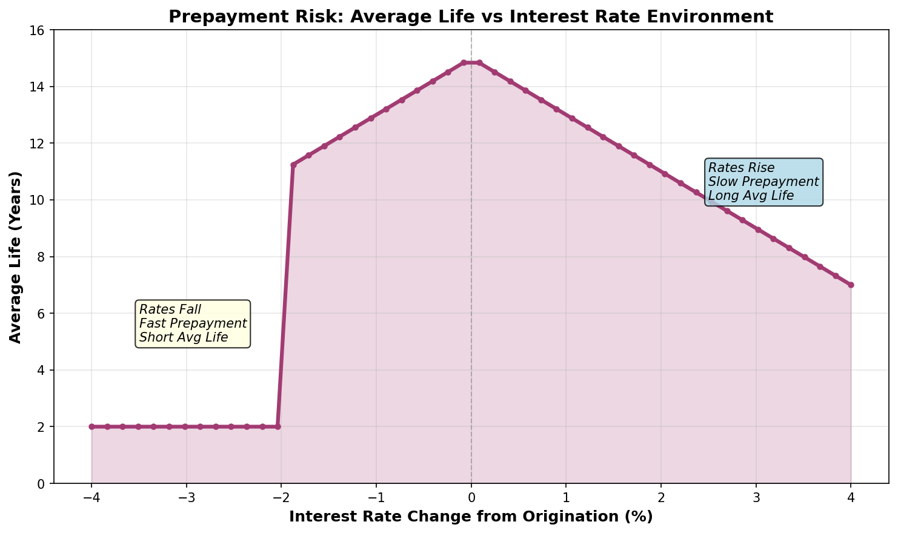

# Prepayment Risk: The Borrower's Advantage Becomes Investor's Disadvantage

## Explanation

Prepayment risk is the risk that homeowners will pay off their mortgages faster than expected, typically when interest rates fall. When rates drop, homeowners can refinance their loans at lower rates, paying off their old mortgages early. From the homeowner's perspective, this is great—they get a lower rate. But for MBS investors, prepayment creates a problem: you get your principal back sooner than expected, and you're forced to reinvest that money in a lower-rate environment. If you bought an MBS yielding 4% and rates fall to 2%, all your principal comes back when you'd much rather hold the 4% security. Additionally, you miss out on the price appreciation you would have experienced if the bond didn't get prepaid. This is called "negative convexity"—the asymmetry where bonds don't appreciate as much as expected when rates fall due to prepayments.

## Real-World Mortgage Example

You invest $1 million in an MBS pool with a 4% coupon and a 30-year maturity. You expect to hold it for the full 30 years and collect $40,000 in annual interest. But when mortgage rates drop to 2.5% the following year, 60% of the homeowners in your pool refinance. Suddenly, you get $600,000 back in prepaid principal. Now you're stuck reinvesting $600,000 at the new 2.5% market rate instead of earning 4% on it. Over 30 years, this lost interest income is substantial. Additionally, the MBS you held appreciated when rates fell (from $100 to maybe $103), but since it prepaid, you never realized that gain—you locked in your loss of future interest income.

## Mathematical Concept

**Prepayment Speed Models:**

The most common model is the **PSA (Public Securities Association) Standard Prepayment Model**, which assumes a ramp-up of prepayments:

```
CPR (Conditional Prepayment Rate) based on PSA:
- Months 1-30: CPR increases by 0.2% per month (6% per year standard benchmark)
- Months 31+: CPR stays constant at 6% (100% PSA)

For 50% PSA: CPR = 50% of the benchmark
For 150% PSA: CPR = 150% of the benchmark
```

**Monthly Prepayment Calculation:**

```
SMM (Single Monthly Mortality) = 1 - (1 - CPR)^(1/12)

Example: If CPR = 6% per year (100% PSA)
SMM = 1 - (1 - 0.06)^(1/12)
    = 1 - (0.94)^0.0833
    = 1 - 0.9949
    = 0.0051 or 0.51%

This means each month, 0.51% of the remaining principal prepays.
```

**Impact on Average Life:**

```
Original Pool: $1,000,000
Maturity: 30 years (360 months)
Coupon: 4% annual (0.333% monthly)

At 100% PSA:
Average Life ≈ 5-7 years (vs 15 years for no prepayment)

At 200% PSA (faster prepayment):
Average Life ≈ 3-4 years
```

### Example Calculation

Pool with $1,000,000 principal, 4% coupon:

```
Month 1:
- Beginning Balance: $1,000,000
- Scheduled Payment: $4,773.64 (includes interest + principal)
- Interest Paid: $3,333
- Scheduled Principal: $1,440
- SMM at Month 1 (2.6% CPR): 0.216%
- Prepayment: (1,000,000 - 1,440) × 0.00216 = $2,155
- Total Principal Reduction: $1,440 + $2,155 = $3,595
- Ending Balance: $996,405

Month 2:
- Beginning Balance: $996,405
- Interest: $3,321
- Scheduled Principal: $1,452
- CPR rises to 5.2%, SMM: 0.432%
- Prepayment: (996,405 - 1,452) × 0.00432 = $4,283
- Total Principal Reduction: $1,452 + $4,283 = $5,735
- Ending Balance: $990,670

... continues until pool is paid off
```

## Visual Graphs: Prepayment Risk Impact



This graph shows the unfavorable asymmetry of prepayment risk. When rates fall, average life shortens dramatically (forcing reinvestment at lower rates), but when rates rise, average life extends (locking you into a lower return). You lose in both directions.

## Key Takeaway

Prepayment risk creates an unfavorable asymmetry for MBS investors: you benefit less than you should when rates fall (because bonds get prepaid), but you still suffer losses when rates rise. This is why investors demand higher yields on MBS compared to Treasury bonds of similar maturity.

---

**Related Terms:** Negative Convexity, CPR, SMM, Extension Risk, Refinancing Risk, PSA Model
