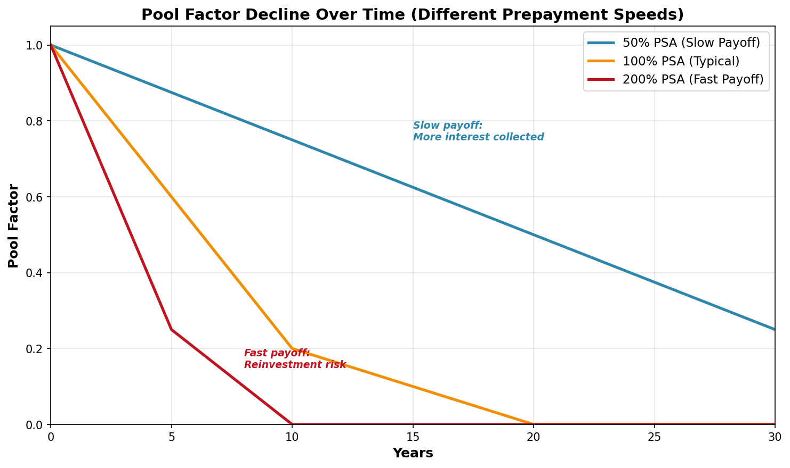

# Pool Factor: Tracking Principal Paydown

## Explanation

Pool factor is a number between 0 and 1.0 that tells you what percentage of the original principal in a mortgage pool still remains outstanding. Every month, as homeowners make payments or prepay their mortgages, the pool factor decreases. A pool factor of 1.0 means 100% of the original principal is still outstanding (the pool just started). A pool factor of 0.5 means half the principal has been paid down. A pool factor of 0.0 means the pool is completely paid off. Pool factor is essential for determining your cash flow: you multiply the MBS's stated coupon rate by the current pool factor to find out how much interest you'll actually receive. It's also used to calculate the "dollar value" of your position—you don't just multiply the MBS price by the original principal; you multiply it by the original principal times the pool factor.

## Real-World Mortgage Example

You buy an MBS certificate for $1,000,000 when the pool factor is 1.0 (brand new pool). The security documents state that it's backed by 500 mortgages. At the end of the first month, homeowners make their regular payments plus some prepay their loans early. The servicer announces the new pool factor is 0.985, meaning 98.5% of the original principal remains. Now your interest check is calculated on $985,000 instead of $1,000,000. After one year, the pool factor drops to 0.94 (6% of principal paid off). If you decide to sell your MBS at this point, the price quote you get from your broker is quoted on par ($100 per $100 face), but the actual dollar amount you receive is: Price Quote × $1,000,000 × 0.94 = Price Quote × $940,000. This is why tracking pool factor is crucial for understanding your true position.

## Mathematical Concept

**Pool Factor Definition:**

```
Pool Factor = Remaining Principal Balance / Original Principal Balance

Where Remaining Principal = Original Principal - Cumulative Principal Paid Down
```

**Dollar Value Calculation:**

```
Current Market Value = Price Quote × Original Principal × Current Pool Factor

Example:
Original Principal: $1,000,000
Current Pool Factor: 0.75
Price Quote: $99.50 per $100 par

Market Value = 0.9950 × $1,000,000 × 0.75
             = $995,000 × 0.75
             = $746,250
```

**Monthly Pool Factor Change:**

```
New Pool Factor = Old Pool Factor × (1 - SMM)

Where SMM = Single Monthly Mortality (prepayment + scheduled payment)

Example:
Month 1 Pool Factor: 1.0
SMM: 0.50% (0.005)
Month 2 Pool Factor: 1.0 × (1 - 0.005) = 0.995
```

### Example Calculation - 12 Month Progression

Initial Pool: $1,000,000, 4% coupon, 100% PSA

| Month | Pool Factor | Remaining Balance | Interest Payment | Principal Paid | Cumulative Principal Paid |
|-------|------------|-------------------|-----------------|----------------|--------------------------|
| 0 | 1.0000 | $1,000,000 | — | — | $0 |
| 1 | 0.9965 | $996,500 | $3,322 | $3,500 | $3,500 |
| 2 | 0.9925 | $992,500 | $3,308 | $4,000 | $7,500 |
| 3 | 0.9880 | $988,000 | $3,293 | $4,500 | $12,000 |
| 4 | 0.9829 | $982,900 | $3,276 | $5,100 | $17,100 |
| 5 | 0.9773 | $977,300 | $3,258 | $5,600 | $22,700 |
| 6 | 0.9710 | $971,000 | $3,237 | $6,300 | $29,000 |
| 7 | 0.9642 | $964,200 | $3,214 | $6,800 | $35,800 |
| 8 | 0.9567 | $956,700 | $3,189 | $7,500 | $43,300 |
| 9 | 0.9486 | $948,600 | $3,162 | $8,100 | $51,400 |
| 10 | 0.9399 | $939,900 | $3,133 | $8,700 | $60,100 |
| 11 | 0.9305 | $930,500 | $3,102 | $9,400 | $69,500 |
| 12 | 0.9205 | $920,500 | $3,068 | $10,000 | $79,500 |

**After 1 year: 7.95% of principal paid down, Pool Factor = 0.9205**

## Visual Graph: Pool Factor Decline Over Time



**Key Milestones at 100% PSA:**
- After 5 years: ~40-50% of principal paid (PF = 0.50)
- After 10 years: ~70-75% of principal paid (PF = 0.25-0.30)
- After 15 years: ~85-90% of principal paid (PF = 0.10-0.15)
- After 30 years: 100% paid (PF = 0.0)

**Pool Factor Impact on Cash Flows:**

Interest Payment = Annual Coupon Rate × Original Principal × Current Pool Factor

Original Principal: $1,000,000 | Annual Coupon: 4%
- Month 1: $1,000,000 × 0.04 ÷ 12 × 1.0000 = $3,333
- Month 6: $1,000,000 × 0.04 ÷ 12 × 0.9710 = $3,237
- Month 12: $1,000,000 × 0.04 ÷ 12 × 0.9205 = $3,068

As shown in the graph, faster prepayment speeds (200% PSA) significantly compress the timeline, while slower speeds (50% PSA) extend it.

## Key Takeaway

Pool factor is your tracking mechanism for how much of your investment has been paid back. It directly affects your interest income and the true dollar value of your position. Faster prepayments mean pool factor declines faster, shortening your average life and reducing total interest collected.

---

**Related Terms:** Principal Paydown, Remaining Balance, Average Life, CPR, SMM, Pass-Through Rate
