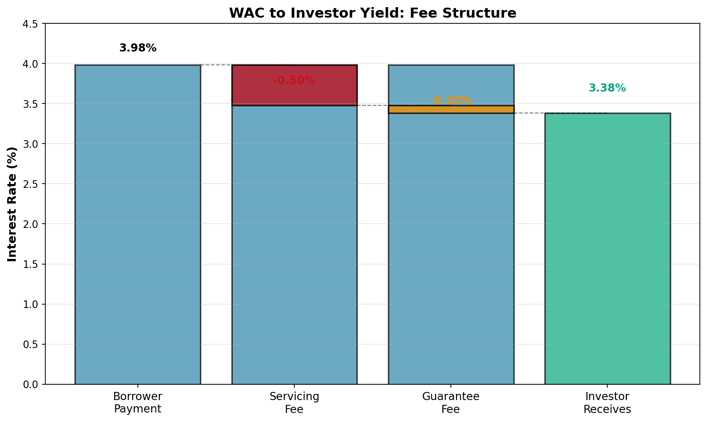

# Weighted Average Coupon (WAC): The True Yield of Your Pool

## Explanation

The Weighted Average Coupon (WAC) is the average interest rate of all mortgages in a pool, weighted by their principal balances. While a mortgage pool might contain mortgages with rates ranging from 3.5% to 4.5%, the WAC tells you the single average rate that matters for your investment. It's "weighted" because larger mortgages have more influence on the average than smaller ones. This is different from the "pass-through rate" (the rate you actually receive as an investor), which is typically 50 basis points lower due to servicing fees and the guarantee fee. WAC is important because it tells you the gross interest rate being collected from borrowers, which helps you understand the potential profitability of the pool and compare it to other MBS offerings. As the pool pays down over time, WAC can shift slightly if faster or slower prepayments disproportionately affect higher or lower-rate mortgages.

## Real-World Mortgage Example

A mortgage pool is backed by 10 loans:
- 4 loans at 3.75% averaging $250,000 each
- 3 loans at 4.00% averaging $300,000 each
- 2 loans at 4.25% averaging $350,000 each
- 1 loan at 4.50% for $400,000

The pool's weighted average coupon accounts for both the rates and the balances. The 3.75% loans represent a larger count but smaller total balance, while the 4.50% loan has the smallest count but significant balance. The WAC is calculated by weighting each rate by its proportion of the total pool. In this case, the WAC comes out to about 3.98%, meaning on average, borrowers are paying slightly under 4%. As an investor, you receive 3.48% (4.00% - 0.50% servicing fee). This WAC is crucial: it tells you that the spread between what borrowers pay and what you receive is tighter than you'd like, making this pool less attractive than one with a 4.50% WAC.

## Mathematical Concept

**Weighted Average Coupon Formula:**

```
WAC = Σ(Coupon_i × Principal_i) / Total Principal

Where:
- Coupon_i = interest rate of mortgage i
- Principal_i = balance of mortgage i
- Total Principal = sum of all principals
```

**Simple Example:**

```
Loan 1: $300,000 at 3.75%
Loan 2: $400,000 at 4.00%
Loan 3: $300,000 at 4.25%
Total: $1,000,000

WAC = (3.75 × 300,000 + 4.00 × 400,000 + 4.25 × 300,000) / 1,000,000
    = (1,125,000 + 1,600,000 + 1,275,000) / 1,000,000
    = 4,000,000 / 1,000,000
    = 4.00%

Each rate contribution:
- 3.75% loan contributes: 3.75 × 0.30 = 1.125%
- 4.00% loan contributes: 4.00 × 0.40 = 1.60%
- 4.25% loan contributes: 4.25 × 0.30 = 1.275%
Total WAC: 1.125% + 1.60% + 1.275% = 4.00%
```

### Example Calculation - MBS Pool with 10 Mortgages

| Loan # | Balance | Rate | Contribution (Rate × Weight) |
|--------|---------|------|------------------------------|
| 1 | $250,000 | 3.75% | 3.75% × 0.0833 = 0.312% |
| 2 | $250,000 | 3.75% | 3.75% × 0.0833 = 0.312% |
| 3 | $250,000 | 3.75% | 3.75% × 0.0833 = 0.312% |
| 4 | $250,000 | 3.75% | 3.75% × 0.0833 = 0.312% |
| 5 | $300,000 | 4.00% | 4.00% × 0.1000 = 0.400% |
| 6 | $300,000 | 4.00% | 4.00% × 0.1000 = 0.400% |
| 7 | $300,000 | 4.00% | 4.00% × 0.1000 = 0.400% |
| 8 | $350,000 | 4.25% | 4.25% × 0.1167 = 0.496% |
| 9 | $350,000 | 4.25% | 4.25% × 0.1167 = 0.496% |
| 10 | $400,000 | 4.50% | 4.50% × 0.1333 = 0.600% |
| **Total** | **$3,000,000** | **WAC** | **3.9800%** |

**Investor receives: 3.98% - 0.50% servicing = 3.48% pass-through rate**

**WAC Change Over Time:**

If one of the 3.75% loans prepays (borrower refinances to 2% elsewhere):
- Remaining balance: $2,750,000
- New WAC = (1,125,000 - 250,000) / 2,750,000 = 4.0182%

The pool's WAC increased because the lowest-rate mortgage left. This illustrates "negative selection" or "adverse prepayment": borrowers with the best rates (lowest rates) are most likely to refinance.

## Visual Graph: WAC Components and Pass-Through Rate



**Spread Analysis:**
- Gross WAC: 3.98%
- Less: Servicing Fee (0.50%)
- Less: Guarantee Fee (0.10%)
- **= Net Investor Yield: 3.38%**

The graph above shows how the interest paid by borrowers is split between servicing costs, guarantee fees (for agency protection), and what you actually receive as an investor. This "fee leakage" is a key consideration when evaluating MBS relative to other investments.

## Key Takeaway

WAC represents the true average interest rate being charged to borrowers in the pool. The difference between WAC and your pass-through rate is the cost of servicing and guarantees. Understanding WAC helps you evaluate pool quality and predict how the pool will perform as interest rates change.

---

**Related Terms:** Weighted Average Maturity (WAM), Pass-Through Rate, Servicing Fee, Guarantee Fee, Gross Coupon, Net Coupon
