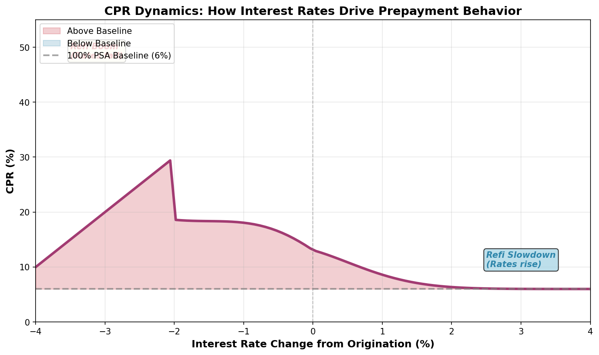
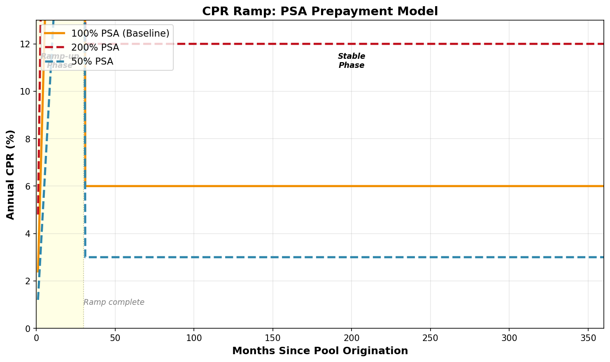

# Constant Prepayment Rate (CPR): Measuring How Fast Mortgages Pay Off

## Explanation

The Constant Prepayment Rate (CPR) is an annualized percentage that estimates how fast mortgages in a pool will be paid off early, beyond their scheduled payments. If the CPR is 6%, it means you expect 6% of the remaining mortgage balance to be paid off (either through refinancing or sale of the home) over the next year. CPR is different from the scheduled amortization rate—even without prepayments, mortgages automatically pay down through regular monthly payments. CPR captures the *extra* payoff beyond that scheduled principal reduction. CPR fluctuates based on interest rates: when rates fall significantly below the mortgage coupon, homeowners have strong incentive to refinance, driving CPR higher. When rates rise, refinancing appeal diminishes, and CPR drops. To convert CPR to a monthly rate (used for actual cash flow calculations), you use the Single Monthly Mortality (SMM) formula, which accounts for the fact that monthly prepayments compound throughout the year.

## Real-World Mortgage Example

You own an MBS pool with a 4% coupon when market rates are at 5%. Since refinancing isn't attractive at current rates, the expected CPR is 20% annually (relatively low). But then the Fed cuts rates sharply, and market rates drop to 2.5%. Suddenly, every homeowner with a 4% mortgage has strong incentive to refinance. The expected CPR spikes to 50% or higher. This means instead of expecting 6% of the pool to prepay annually, you now expect 50% to refinance within the next 12 months. A $1 million pool that you expected to pay down $60,000 in principal over the year suddenly starts paying down $500,000. Your cash comes back much faster, but you're forced to reinvest it at the new, lower 2.5% rates. This is prepayment risk in action—the flip side of the coin is that CPR is currently low, so you're protected if rates rise further.

## Mathematical Concept

**CPR to SMM Conversion:**

```
SMM (Single Monthly Mortality) = 1 - (1 - CPR)^(1/12)

The 1/12 power accounts for monthly compounding.

Example:
If CPR = 6% (0.06)
SMM = 1 - (1 - 0.06)^(1/12)
    = 1 - (0.94)^(0.0833)
    = 1 - 0.9949
    = 0.0051 or 0.51%

This means each month, 0.51% of the remaining principal prepays (plus scheduled).
```

**Reverse: SMM to CPR:**

```
CPR = 1 - (1 - SMM)^12

Example:
If SMM = 0.51% (0.0051)
CPR = 1 - (1 - 0.0051)^12
    = 1 - (0.9949)^12
    = 1 - 0.9399
    = 0.0601 or 6.01%
```

**Monthly Prepayment Calculation:**

```
Monthly Prepayment Amount = (Beginning Balance - Scheduled Principal) × SMM

Example - Month 1 of $1M pool, 4% coupon, CPR = 6% (SMM = 0.51%):

Beginning Balance: $1,000,000
Monthly Interest (4% ÷ 12): $3,333
Scheduled Principal Payment: $1,440 (using 30-year amortization)
Balance After Scheduled Payment: $1,000,000 - $1,440 = $998,560

Prepayment (at 0.51% SMM): $998,560 × 0.0051 = $5,092

Total Principal: $1,440 + $5,092 = $6,532
Ending Balance: $1,000,000 - $6,532 = $993,468
```

### Example Calculation - CPR Impact on Pool Payoff

**Pool: $1,000,000, 4% coupon, 30-year original term**

| Year | CPR | SMM | Beginning Balance | Annual Scheduled Principal | Annual Prepayment | Total Principal Paid | Ending Balance |
|------|-----|-----|-------------------|---------------------------|-------------------|----------------------|-----------------|
| 1 | 6% | 0.51% | $1,000,000 | $17,280 | $49,920 | $67,200 | $932,800 |
| 2 | 12% | 0.95% | $932,800 | $15,810 | $100,150 | $115,960 | $816,840 |
| 3 | 18% | 1.39% | $816,840 | $13,760 | $150,200 | $163,960 | $652,880 |
| 4 | 24% | 1.82% | $652,880 | $10,180 | $175,000 | $185,180 | $467,700 |
| 5 | 30% | 2.24% | $467,700 | $6,800 | $150,000 | $156,800 | $310,900 |
| 6 | 30% | 2.24% | $310,900 | $4,100 | $100,200 | $104,300 | $206,600 |
| 7 | 30% | 2.24% | $206,600 | $2,430 | $67,300 | $69,730 | $136,870 |
| 8 | 30% | 2.24% | $136,870 | $1,530 | $44,500 | $46,030 | $90,840 |

**Timeline Comparison:**

```
Same Pool, Different CPR Scenarios:

No Prepayment (CPR = 0%):
Pool paid off in 30 years, Total Interest: ~$2.15M

CPR = 6% (100% PSA):
Pool paid off in ~8-10 years, Total Interest: ~$1.4M

CPR = 50% (600% PSA - refinancing boom):
Pool paid off in ~2-3 years, Total Interest: ~$650k

CPR = 2% (low refinancing):
Pool paid off in ~15-20 years, Total Interest: ~$1.8M
```

## Visual Graphs: CPR Dynamics



The graph above shows the critical relationship between interest rates and CPR. Borrowers refinance when new rates are 1%+ lower, which is why CPR spikes dramatically in a falling rate environment.



The PSA model assumes that CPR ramps up gradually over the first 30 months (0.2% per month for 100% PSA), then stabilizes. At 200% PSA, everything happens twice as fast; at 50% PSA, the ramp is half as steep. Understanding the CPR ramp is essential because most pools are in their ramp-up phase when investors first purchase them.

## Key Takeaway

CPR is your primary tool for estimating how quickly a mortgage pool will be paid off. Higher CPR (driven by falling rates and refinancing incentives) shortens your average life and forces reinvestment risk. Lower CPR extends your hold period but exposes you to extension risk if rates keep rising. Most MBS analysis centers on CPR forecasting and its impact on duration and cash flows.

---

**Related Terms:** Single Monthly Mortality (SMM), PSA Model, Prepayment Risk, Refinancing, CPR Ramp, Refiability Index, Incentive Refinance Threshold
