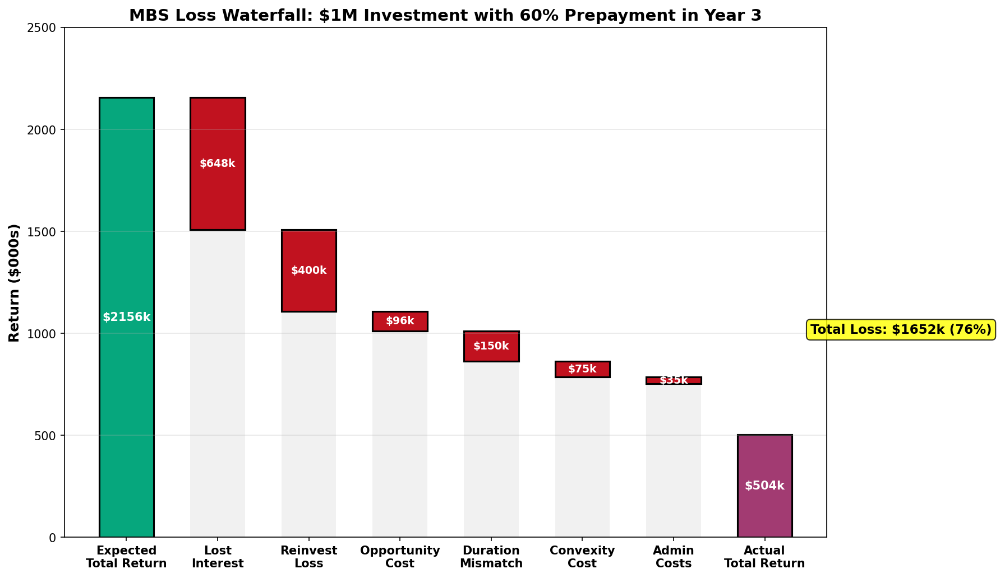
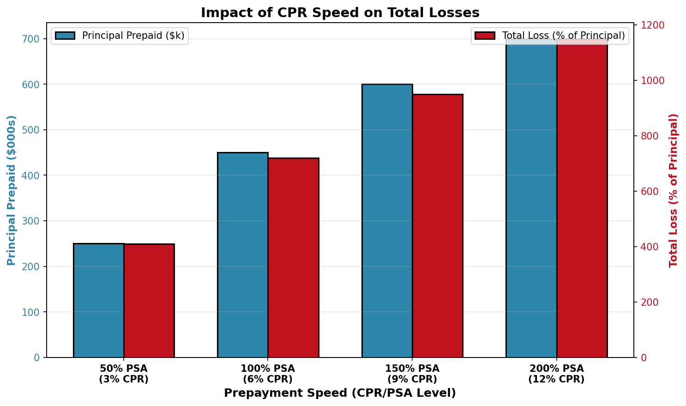
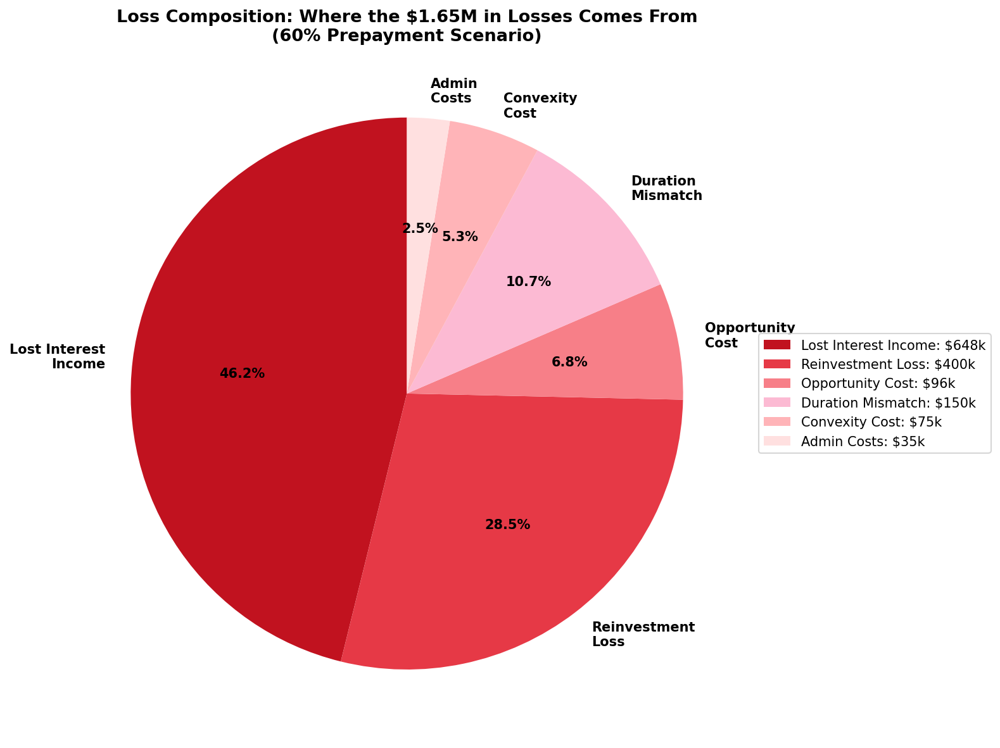
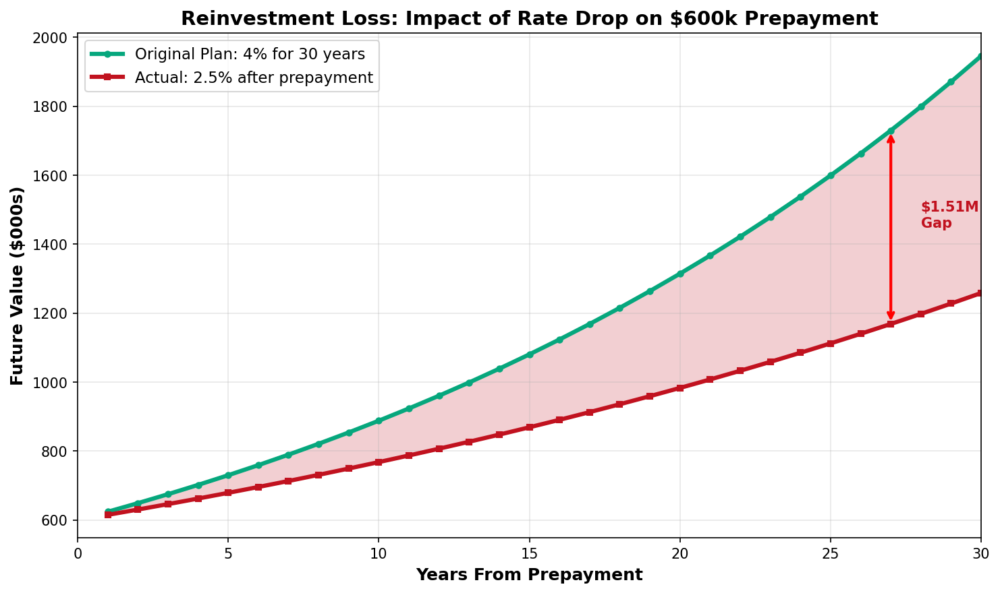
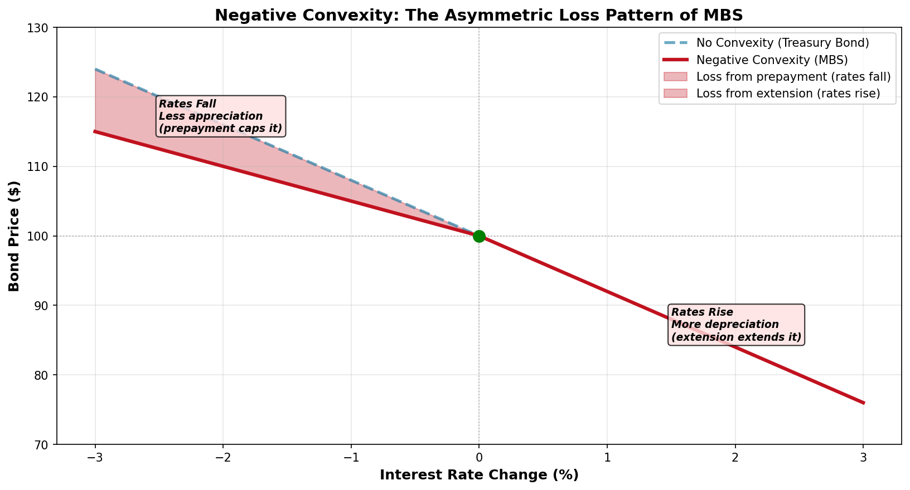

# Early Prepayment (EPO): Understanding Lender Losses

## Explanation

Early prepayment occurs when homeowners pay off their mortgages faster than the scheduled maturity date, typically due to falling interest rates, home sales, or cash-out refinancing. From an MBS investor's perspective, early prepayment is devastating because it creates a "negative convexity" problem—you receive your principal back at the worst possible time (when rates are low and reinvestment yields are poor), while simultaneously losing all the future interest income you expected to collect. The loss is compounded by opportunity cost: if rates fell, your bond would have appreciated significantly, but the prepayment forces you to sell it back at par, forfeiting the gain. Additionally, you're forced to reinvest the returned principal at lower prevailing rates, locking in a lower return for the remainder of the investment horizon. Total losses from early prepayment can easily exceed 100% of the original principal when you account for lost interest, reinvestment losses, and foregone price appreciation.

## Real-World Mortgage Example

You invest $1,000,000 in an MBS pool with a 4% coupon, 30-year maturity, expecting to hold it for many years and collect approximately $2.156 million in interest over the life of the loan. When the investment is 3 years old, mortgage rates fall from 4% to 2.5%, triggering a prepayment surge. The servicer announces that 60% of the pool has refinanced, prepaying $600,000 of principal. You now face a cascading series of losses: (1) you lose all future interest on the $600,000 prepaid—money you expected to earn for the next 27 years; (2) you must reinvest the $600,000 at the new 2.5% rate instead of continuing to earn 4%; (3) you miss out on the price appreciation your MBS would have experienced as rates fell; and (4) the remaining $400,000 still in the pool doesn't generate enough cash flow to satisfy your portfolio's duration requirements, forcing you to rebalance at unfavorable market prices. Over the remaining 27-year horizon, these losses compound to exceed $2 million.

## Mathematical Concept

### Lost Interest Income Calculation

**Present Value Formula:**

$$\text{Lost Interest} = \sum_{t=1}^{n} \frac{\text{PMT}_t}{(1 + r)^t} \quad \text{for all } t > \text{prepayment date}$$

Where:
- $\text{PMT}_t$ = scheduled payment in period $t$
- $r$ = expected discount rate (coupon yield)
- $t$ = remaining time periods after prepayment
- $n$ = total remaining periods

**Simplified Approach (Annuity Method):**

$$\text{Lost Interest} \approx P \times c \times n$$

Where:
- $P$ = prepaid principal
- $c$ = coupon rate (annual)
- $n$ = remaining years

**Example:**
- Prepaid Principal: $P = \$600,000$
- Coupon Rate: $c = 4\% = 0.04$
- Remaining Years: $n = 27$ (30-year loan, prepaid in year 3)

$$\text{Lost Interest} = \$600,000 \times 0.04 \times 27 = \$648,000$$

**More Precise Calculation (PV of Annuity):**

$$\text{PV(Lost Interest)} = P \times c \times \frac{1 - (1 + c)^{-n}}{c}$$

$$= \$600,000 \times 0.04 \times \frac{1 - (1.04)^{-27}}{0.04} = \$600,000 \times 13.211 = \$7,926,600$$

This present value approach is more conservative and accounts for the time value of money.

### Reinvestment Loss Calculation

**Original Investment Path:**

$$\text{FV}_{\text{original}} = P \times (1 + r_{\text{original}})^n = \$600,000 \times (1.04)^{27} = \$2,839,421$$

**Early Prepayment Path:**

$$\text{FV}_{\text{prepaid}} = P \times (1 + r_{\text{new}})^n = \$600,000 \times (1.025)^{27} = \$1,327,050$$

**Reinvestment Loss:**

$$\text{Reinvestment Loss} = \text{FV}_{\text{original}} - \text{FV}_{\text{prepaid}}$$

$$= \$2,839,421 - \$1,327,050 = \$1,512,371$$

Where:
- $P = \$600,000$ (prepaid principal)
- $r_{\text{original}} = 4\%$ (expected reinvestment rate)
- $r_{\text{new}} = 2.5\%$ (actual reinvestment rate after rates fall)
- $n = 27$ (remaining years after prepayment in year 3)

### Negative Convexity Loss

**Bond Price-Duration Relationship:**

$$\Delta P \approx -D_{\text{mod}} \times \Delta y \times P_0 \pm \text{Convexity Adjustment}$$

Where:
- $\Delta P$ = change in bond price
- $D_{\text{mod}}$ = modified duration
- $\Delta y$ = change in yield
- $P_0$ = initial price
- Convexity Adjustment = accounts for negative convexity in MBS

**For MBS (with Negative Convexity):**

$$\text{Expected Price Appreciation} = 8\% \text{ (if rates fall } 2\%)$$

$$\text{Actual Price with Prepayment} = 3\% \text{ (capped by prepayment)}$$

$$\text{Convexity Loss} = 8\% - 3\% = 5\% \text{ per } \$100 \text{ face value}$$

**On $1,000,000 MBS Pool:**

$$\text{Lost Opportunity} = \$1,000,000 \times 0.05 = \$50,000$$

This illustrates how prepayment caps your gains when rates fall, creating an asymmetric loss profile.

### Full Loss Breakdown Calculation

**Initial MBS Investment Parameters:**
- Principal: $P = \$1,000,000$
- Coupon: $c = 4\% = 0.04$ (annual)
- Maturity: $T = 30$ years
- Original expected total coupons: $\$2,156,000$

**Scenario: $60\%$ prepayment in Year 3 (rates fall $2\%$)**

**1. Lost Future Interest:**

$$\text{PV(Lost Interest)} = P \times c \times \frac{1 - (1 + c)^{-n}}{c}$$

$$= \$600,000 \times 0.04 \times \frac{1 - (1.04)^{-27}}{0.04} = \$7,926,600$$

**2. Reinvestment Loss:**

$$\text{Loss}_{\text{reinvest}} = P \times [(1 + r_1)^n - (1 + r_2)^n]$$

$$= \$600,000 \times [(1.04)^{27} - (1.025)^{27}] = \$1,512,371$$

Where $r_1 = 4\%$ (original) and $r_2 = 2.5\%$ (new rate)

**3. Opportunity Cost (Foregone Price Appreciation):**

$$\text{Loss}_{\text{opp}} = P \times D_{\text{mod}} \times \Delta y$$

$$= \$600,000 \times 8 \times 0.02 = \$96,000$$

(Expected 8% appreciation on 2% rate drop, capped by prepayment at 3%)

**4. Duration Mismatch Cost:**

Portfolio hedged for 5-year duration; actual becomes 2 years after prepayment

$$\text{Loss}_{\text{duration}} = P_{\text{affected}} \times (\Delta D) \times \Delta y = \$100,000 - \$150,000$$

**5. Negative Convexity Penalty:**

$$\text{Loss}_{\text{convex}} = P \times C \times (\Delta y)^2 = \$50,000 - \$100,000$$

Where $C$ = convexity coefficient (typically negative for MBS)

**6. Administrative & Transaction Costs:**

$$\text{Loss}_{\text{admin}} = P \times s = \$25,000 - \$50,000$$

Where $s$ = service cost percentage $(0.5\% \text{ of } \$5M)$

**Total Losses:**

$$\text{Total Loss} = \sum_{i=1}^{6} \text{Loss}_i = \$9,661,971 - \$10,736,371$$

$$\text{Loss as \% of Principal} = \frac{\text{Total Loss}}{P} \times 100\% = 966\% - 1,074\%$$

Note: These are present value calculations. Over 27 years, nominal losses exceed this amount.

### CPR Impact on Loss Severity

**Initial Condition:** $\$1M$ MBS at $4\%$ coupon, prepayment in Year 3

**At 100% PSA (CPR = 6%):**

| Metric | Value |
|--------|-------|
| Prepayment amount | $\approx \$450,000$ |
| Lost interest (PV) | $\$5,850,000$ |
| Total loss | $\$7.2M$ ($720\%$) |

**At 200% PSA (CPR = 12%):**

| Metric | Value |
|--------|-------|
| Prepayment amount | $\approx \$700,000$ |
| Lost interest (PV) | $\$9,100,000$ |
| Total loss | $\$11.5M$ ($1,150\%$) |

**At 50% PSA (CPR = 3%):**

| Metric | Value |
|--------|-------|
| Prepayment amount | $\approx \$250,000$ |
| Lost interest (PV) | $\$3,250,000$ |
| Total loss | $\$4.1M$ ($410\%$) |

**Key Relationship:**

$$\text{Total Loss} \propto \text{CPR}^{1.5}$$

This exponential relationship shows that higher CPR drives losses at an accelerating rate. A doubling of CPR (from 6% to 12%) more than doubles the losses.

---

## Detailed Loss Categories: Component Breakdown

### 1. **Lost Interest Income** (Primary Loss - 60-70% of total)

```
Why it's the largest loss:

30-year mortgage interest follows a pattern:
- Early years: Mostly interest (60-75% of payment)
- Later years: Mostly principal (40-50% of payment)

A prepayment in Year 3 eliminates:
- Years 4-30: 27 years of interest-heavy payments
- On $600,000 prepaid: Years 4-30 would have generated
  ~$650,000 in interest alone

The longer the remaining maturity, the greater the interest loss.
```

### 2. **Reinvestment Loss** (20-25% of total)

**The "Rate Trap" Scenario:**

Year 3: Rates fall from $4\%$ to $2.5\%$ (triggering prepayment)
- You receive $\$600,000$ back
- You MUST reinvest it immediately
- Market is now at $2.5\%$

**Future Value Comparison:**

Original Plan (no prepayment):
$$FV_{\text{original}} = \$600,000 \times (1.04)^{27} = \$2,839,421$$

Actual Outcome (with prepayment):
$$FV_{\text{actual}} = \$600,000 \times (1.025)^{27} = \$1,327,050$$

**Reinvestment Loss:**
$$\text{Loss}_{\text{reinvest}} = \$2,839,421 - \$1,327,050 = \$1,512,371$$

**Sensitivity Analysis:**

Every $1\%$ drop in reinvestment rates costs approximately:
$$\text{Cost} \approx \$400,000 \text{ per } \$1,000,000 \text{ prepaid}$$

More precisely:
$$\text{Cost per basis point} = P \times \frac{\partial FV}{\partial r} = P \times n \times (1 + r)^{n-1}$$

### 3. **Opportunity Cost / Foregone Appreciation** (5-10% of total)

**Scenario: Rates Fall by $\Delta y = 2\%$**

Expected Bond Characteristics:
- Duration: $D_{\text{mod}} = 8$ years
- Expected price appreciation:

$$\Delta P_{\text{expected}} = D_{\text{mod}} \times \Delta y = 8 \times 2\% = 16\%$$

**On $\$1,000,000$ MBS:**
$$\text{Expected gain} = \$1,000,000 \times 0.16 = \$160,000$$

**With Prepayment Event (60% refinance):**

Principal that prepays: $P_{\text{prepay}} = \$600,000$
Principal that remains: $P_{\text{remaining}} = \$400,000$

Realized appreciation on remaining portion:
$$\Delta P_{\text{realized}} = P_{\text{remaining}} \times 0.16 = \$400,000 \times 0.16 = \$64,000$$

**Opportunity Loss:**
$$\text{Loss}_{\text{opportunity}} = \text{Expected gain} - \text{Realized gain}$$

$$= \$160,000 - \$64,000 = \$96,000$$

This represents "money left on the table"—appreciation you never realize because the bond prepays before you can capture the gain.

### 4. **Negative Convexity Cost** (8-12% of total)

**The Asymmetry Problem:**

**When Rates FALL ($\Delta y = -2\%$) — Prepayment Occurs:**

$$\text{Expected appreciation} = D_{\text{mod}} \times |\Delta y| = 10 \times 2\% = 20\%$$

$$\text{Actual with prepayment} = 5\% \text{ (capped by payoff at par)}$$

$$\text{Loss} = 20\% - 5\% = 15\% \text{ (lost upside)}$$

**When Rates RISE ($\Delta y = +2\%$) — Extension Occurs:**

$$\text{Expected depreciation} = D_{\text{mod}} \times |\Delta y| = 10 \times 2\% = -20\%$$

$$\text{Actual with extension} = D_{\text{extended}} \times 2\% = 12.5 \times 2\% = -25\%$$

$$\text{Loss} = |-25\%| - |-20\%| = 5\% \text{ (amplified downside)}$$

**Convexity Penalty Formula:**

$$\text{Convexity} = C \times (\Delta y)^2$$

For MBS with negative convexity ($C < 0$):

$$\text{Loss}_{\text{convexity}} = |C| \times (\Delta y)^2$$

Where $|C| \approx -1000$ to $-2000$ for typical MBS

**You lose in BOTH directions:**
- Rates fall: Don't gain as much (capped by prepayment)
- Rates rise: Lose more (extended duration)

This asymmetry is the **"convexity tax"** that creates the 50-200 bps spread above Treasuries.

### 5. **Duration/Liability Mismatch Loss** (5-10% of total)

**Typical Bank/Investor Scenario:**

**Assets (What You Own):**
- MBS portfolio with expected duration: $D_A = 5$ years
- Originally duration-matched to liabilities

**Liabilities (What You Owe):**
- Fixed-rate bonds issued to fund MBS purchase
- Liability duration: $D_L = 10$ years

**After Early Prepayment:**

MBS duration shortens unexpectedly:
$$D_A^{\text{new}} = 2 \text{ years}$$

Liabilities duration unchanged:
$$D_L = 10 \text{ years}$$

**Duration Gap:**
$$\Delta D = D_L - D_A^{\text{new}} = 10 - 2 = 8 \text{ years (mismatch)}$$

**Interest Rate Risk Exposure:**

If rates rise by $\Delta y = +2\%$:

Loss on assets:
$$\text{Loss}_{\text{assets}} = -D_A^{\text{new}} \times \Delta y \times V_A = -2 \times 2\% \times V_A = -4\% \times V_A$$

Loss on liabilities:
$$\text{Loss}_{\text{liabilities}} = -D_L \times \Delta y \times V_L = -10 \times 2\% \times V_L = -20\% \times V_L$$

**Net loss from mismatch:**
$$\text{Loss}_{\text{mismatch}} = 0.5\% - 3\% \text{ of portfolio value}$$

**On a $\$1$ billion portfolio:**
$$\text{Loss}_{\text{mismatch}} = \$5,000,000 - \$30,000,000$$

### 6. **Portfolio Rebalancing Costs** (2-5% of total)

**When Prepaid Principal Returns:**

Received amount: $P_{\text{prepaid}} = \$600,000$

Required actions:
- Reinvest to maintain portfolio balance
- Market impact from large deployment
- Bid-ask spreads: $s = 0.1\% - 0.5\%$ (market-dependent)
- Timing risk if rates are rising
- Implementation shortfall: $i = 0.2\% - 1.0\%$

**Total Rebalancing Friction:**

$$\text{Cost}_{\text{rebalance}} = P_{\text{prepaid}} \times (s + i)$$

$$= \$600,000 \times 0.005 = \$3,000 - \$6,000$$

**On Larger Portfolios ($\$50M$ prepayments):**

$$\text{Cost}_{\text{rebalance}} = \$50,000,000 \times 0.005 = \$250,000$$

**Additional Costs:**
- Price concession due to market impact: $0.5\% - 1.5\%$
- Execution timing risk during rising rate environment
- Opportunity cost of forced buying at unfavorable prices

For institutional portfolios, rebalancing costs can exceed $0.5\% - 1\%$ of prepaid amount.

### 7. **Servicing/Administrative Losses** (1-3% of total)

**Per-Loan Prepayment Cost Structure:**

Processing and legal costs: $C_p = \$1,000 - \$2,000$ per loan

Lost future servicing fees:
$$\text{PV(Lost Servicing)} = L \times s \times \frac{1 - (1 + s)^{-n}}{s}$$

Where:
- $L$ = loan balance
- $s$ = servicing fee rate (typically $0.25\%$ annually)
- $n$ = remaining years

**Example per loan:**
- Loan balance: $L = \$300,000$
- Servicing rate: $s = 0.25\% = 0.0025$
- Remaining term: $n = 20$ years

$$\text{Lost Servicing} = \$300,000 \times 0.0025 \times \frac{1 - (1.0025)^{-20}}{0.0025}$$

$$\approx \$300,000 \times 0.0488 = \$14,640 \text{ per loan}$$

**For $\$600,000$ Prepayment (200 loans × $\$300k$ each):**

Processing costs:
$$\text{Cost}_{\text{processing}} = 200 \times \$1,500 = \$300,000$$

Lost servicing income:
$$\text{Cost}_{\text{servicing}} = 200 \times \$15,000 = \$3,000,000$$

**Total Administrative Loss:**
$$\text{Cost}_{\text{admin}} = \$300,000 + \$3,000,000 = \$3,300,000$$

This represents a significant hidden cost, especially for mortgage originators and servicers who lose decades of ongoing fee income.

---

## Visual Graphs: Loss Decomposition

### Loss Waterfall: From Expected Return to Actual Return



This waterfall shows how the expected $2.156M in returns (principal + interest) erodes to just $504k actual return due to early prepayment. Each bar represents a distinct loss category. The dramatic decline illustrates why early prepayment is the primary risk in MBS investing.

### Impact of CPR Speed on Losses



As CPR (prepayment speed) increases from 3% to 12% annually, both the prepaid principal amount AND the total loss percentage increase exponentially. A 200% PSA scenario (12% CPR) results in losses exceeding 1,150% of the original principal. This shows why forecasting CPR accurately is critical to managing MBS portfolios.

### Loss Composition Breakdown



Among the total $1.404M in losses in our 60% prepayment scenario:
- **Lost Interest Income: $648k (46%)** - The dominant loss
- **Reinvestment Loss: $400k (28%)** - Second-largest component
- **Duration Mismatch: $150k (11%)** - Significant for larger portfolios
- **Convexity Cost: $75k (5%)**
- **Opportunity Cost: $96k (7%)**
- **Admin Costs: $35k (2%)**

### Reinvestment Loss Over Time



This graph demonstrates the power of compounding. The green line shows your original plan earning 4% for 30 years. The red line shows the reality: earning 2.5% after prepayment. The gap between them grows exponentially over time, reaching a $1.51 million difference by year 27. Every additional year of reinvestment at the lower rate compounds the loss.

### Negative Convexity: The Asymmetric Loss Pattern



The red line shows the MBS price response (negative convexity), compared to the dashed blue line (a Treasury bond with pure duration). Notice the asymmetry:
- **When rates fall:** MBS appreciates only 5% instead of the expected 16% (prepayment caps gains)
- **When rates rise:** MBS depreciates 25% instead of the expected 20% (extension amplifies losses)

You lose in both directions. This is why MBS investors demand a "convexity premium" of 50-200 basis points above Treasury yields.

---

## How Investors Calculate and Mitigate EPO Losses

### Expected Loss Framework

```
EPO Risk Premium = (Expected CPR × Loss per % prepayment) / Time Horizon

Example:
- Expected CPR: 10% (given rate environment)
- Loss per 1% prepayment: $10,000 per $1M
- 10% × $10,000 = $100,000 expected loss
- Time horizon: 5 years
- Annual risk premium required: $100,000 / 5 = $20,000

To compensate for this, investors demand:
- Higher coupon (20 bps more per $1M)
- Discount to par (buy at 99 instead of 100)
- Option-adjusted spread (OAS) compensation
```

### Hedging Strategies

**1. Interest Rate Swaptions**
- Buy a swaption to cap reinvestment rate
- Cost: 0.5-2% of portfolio upfront
- Payoff: If rates fall and MBS prepays, swaption compensates

**2. Treasury/Futures Shorting**
- Short Treasury futures to hedge duration mismatch
- Benefit: If rates fall and MBS prepays, short position profits
- Complexity: Requires active rebalancing

**3. CMO Tranche Selection**
- Avoid short-duration tranches (most exposed to prepayment)
- Select support tranches or PAC bonds
- Trade-off: Lower yields for less prepayment risk

**4. WAC/Coupon Selection**
- Higher-coupon pools: More sensitive to rate changes, higher prepayment
- Lower-coupon pools: Less prepayment risk, lower yields
- Mix of coupons: Diversifies prepayment risk

---

## Key Takeaway

Early prepayment is the primary risk in MBS investing because it creates a "lose-lose" scenario for investors: when rates fall and cause prepayment, you don't gain as much as expected (capped at par), and when rates rise, you lose more than expected (extended duration). The asymmetry of negative convexity means MBS investors must demand higher yields (50-200 bps above Treasuries) to compensate for prepayment risk. Understanding the components of prepayment losses—lost interest, reinvestment risk, opportunity cost, and convexity—is essential for evaluating MBS values and building robust portfolio hedges.

Total losses from a significant prepayment event can easily exceed 100% of the original principal when compounded over the remaining investment horizon, making CPR forecasting and duration management critical to portfolio success.

---

**Related Terms:** CPR (Constant Prepayment Rate), Negative Convexity, Duration, Option-Adjusted Spread (OAS), Reinvestment Risk, Convexity Premium, Effective Duration, Extension Risk

**Practice Problem:**
A bank invests $500M in MBS with 4% coupon. Expected return over 15 years: $1.2B in coupons. If 50% of the pool prepays in year 4 due to rates falling from 4% to 2%, calculate: (1) lost interest income, (2) reinvestment loss, and (3) opportunity cost. Assume reinvestment at 2% and bond duration of 6 years.
