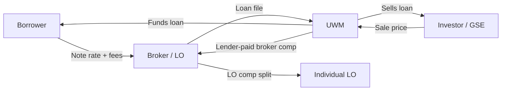

# UWM Wholesale: LO Comp & Broker Comp Jargon Guide

A reference for the terminology used when discussing **loan originator compensation (LO comp)** and **broker compensation** in the **United Wholesale Mortgage (UWM)** wholesale channel.

This guide is written for someone reading UWM pricing, margin economics, or compliance conversations — not for quoting live rate sheets (those are broker-only and change daily).

---

## How the Pieces Fit Together

In UWM's wholesale model, three different "comp" layers often get conflated:

| Layer | Who Gets Paid | Who Pays | Typical Discussion |
|-------|---------------|----------|-------------------|
| **Broker compensation** | The mortgage brokerage (shop) | UWM (lender-paid) or borrower (borrower-paid) | Rate sheet, lock desk, closing disclosure |
| **LO comp** | Individual loan officer inside the brokerage | The brokerage | Payroll, splits, bonus plans |
| **Lender margin / gain-on-sale** | UWM as wholesaler | Secondary market investors (indirectly) | UWM earnings, capital markets |

**Rule of thumb:** Broker comp is the **gross revenue** the shop earns on the loan. LO comp is how the shop **distributes** that revenue (or a fixed plan) to its originators.

---

## Core Terms (A–Z)

| Term | Definition |
|------|------------|
| **Basis Points (bps)** | One hundredth of a percent. 100 bps = 1% of the loan amount. On a $400,000 loan, 100 bps = $4,000. Comp, margin, LLPAs, and gain-on-sale are almost always discussed in bps. |
| **Best Execution** | Shopping wholesalers and pricing options to find the best combination of **borrower rate/cost**, **broker comp**, and **turn times** for a given loan. Brokers compare UWM against other wholesalers on the same loan scenario. |
| **Borrower-Paid Compensation (BPC)** | Compensation paid by the borrower as an origination charge or points on the Closing Disclosure — not funded by the lender's margin. The broker/LO cannot receive both prohibited forms of dual compensation on the same transaction. |
| **Broker** | Independent mortgage company (broker shop) that originates with the borrower and submits the file to a wholesaler like UWM. The broker is typically the **loan originator organization** for regulatory purposes. |
| **Broker Compensation** | What the **brokerage** earns on a closed loan — usually expressed as a % of loan amount (e.g., 100 bps = 1.00% = $4,000 on $400,000). In wholesale, this is most often **lender-paid** and built into the pricing the broker selects on the rate sheet. |
| **Broker Owner** | Principal of the mortgage brokerage. At UWM, broker owners can sometimes set shop-level comp policies (e.g., different comp targets for purchase vs. refinance) that affect how individual LOs can price loans competitively. |
| **Clawback / Early Payoff Provision** | Contractual requirement that the broker return some or all compensation if the loan pays off or refinances within a defined window (e.g., 6–12 months). Relevant to broker economics and EPO risk, not day-to-day pricing. |
| **Closing Disclosure (CD)** | Final disclosure of loan terms and all compensation/fees. Broker compensation (lender-paid or borrower-paid) must be disclosed here. |
| **Compensation Plan** | Written plan governing how originators are paid. For broker shops: plan for paying LOs. For UWM's relationship with brokers: the lender-paid comp structure on the rate sheet. Must comply with the LO Comp Rule. |
| **Control Your Price (CYP)** | UWM program giving brokers a pool of basis points to apply flexibly — e.g., improve borrower pricing, offset LLPAs, or support competitive offers. Often discussed alongside volume incentives and quarterly bps pools. Not the same as broker comp itself; it's a **pricing tool** brokers can deploy. |
| **Correspondent Channel** | Originators who close in their own name and sell to lenders/investors. Different from wholesale broker channel; comp mechanics differ. |
| **Discount Points** | Upfront fee paid by borrower to buy down the rate. Distinct from lender-paid broker comp, though both affect total borrower cost. |
| **Dual Compensation** | Receiving compensation from both borrower and lender on the same loan in a prohibited structure. Banned under post-Dodd-Frank rules. |
| **Exact Rate** | UWM's broker pricing/lock tool (brand name). Where brokers pull live rate sheets, LLPAs, credits, and comp options. |
| **Gain-on-Sale (GOS)** | UWM's profit from selling the loan on the secondary market: roughly **sale price received minus amount funded**, before or after internal costs depending on context. UWM reports company-level GOS margin in bps (e.g., ~100–150 bps in recent periods). **Not** the same as broker comp. |
| **Gross Gain on Sale** | Top-line spread on the loan sale before deducting broker pay, origination costs, hedging, MSR effects, etc. In margin walkthroughs: investor sale price minus par funded amount. |
| **Investor Sale Price** | Price UWM receives when selling the loan (expressed vs. par 100). Example: 101.00 on a $400,000 loan → $404,000 proceeds. |
| **Lender Credit** | Credit from lender to borrower to offset closing costs, often created by accepting a slightly higher rate. Related to pricing grid but not the same as broker comp line item. |
| **Lender Margin (built-in)** | Spread UWM embeds between **investor/agency pricing** and the **broker-facing rate sheet**. Covers broker comp, origination/operating costs, hedging, and target profit. Typical illustrative range: 75–100 bps. |
| **Lender-Paid Compensation (LPC)** | Broker comp paid by UWM at closing, funded through the rate/pricing structure the broker chose. Most common wholesale model. Appears on the CD as lender-paid compensation to the broker. |
| **LLPA (Loan-Level Price Adjustment)** | Risk-based price adjustment from agency guidelines (FICO, LTV, purpose, occupancy, cash-out, etc.). Expressed in points/% of loan amount; reduces net price unless waived or credited. UWM frequently promotes LLPA waivers/credits (FHA/VA/USDA, conventional credits, promos like Refi '86). |
| **Loan Estimate (LE)** | Initial disclosure of estimated terms and compensation. |
| **Loan Officer (LO) / MLO** | Individual originator licensed to take applications and guide borrowers. May work for a broker shop or (in retail) for a lender directly. |
| **LO Comp / LO Comp Rule** | **Loan Originator Compensation Rule** (TILA Reg Z §1026.36). Prohibits paying originators based on **terms or conditions** of the transaction (rate, fees, loan type as a steering proxy, etc.). Applies to individual LOs **and** the broker organization receiving lender-paid comp. |
| **LO Comp Plan (inside a broker shop)** | How the brokerage pays its LOs: e.g., 50% split of gross broker comp, flat $ per loan, salary + bonus, tiered volume bonuses. Must be fixed/fair under LO Comp — cannot vary loan-by-loan based on rate or profitability of terms. |
| **Loan Amount** | Base for almost all comp and margin math. Bps × loan amount = dollars. |
| **Margin (Lender)** | See **Lender Margin**. In UWM context, the cushion between investor pricing and broker sheet that pays broker comp + costs + profit. |
| **MSR (Mortgage Servicing Rights)** | Value of the right to service the loan. UWM often retains servicing; MSR value affects **net** gain-on-sale after sale but is separate from broker comp line items. |
| **Net Profit / Net Gain-on-Sale Margin** | What's left for UWM after broker comp, origination costs, hedging, and MSR effects — the lender's bottom-line profit per loan. Illustrative target: 50–100 bps. |
| **Note Rate** | Interest rate the borrower pays. Chosen from the rate sheet; higher note rate typically allows more room for lender-paid broker comp and/or lender credits. |
| **Origination Costs** | UWM internal costs to manufacture the loan: processing, underwriting, closing, hedging, technology, compliance, etc. Often modeled as ~75 bps in margin examples. |
| **Par / Par Pricing** | Pricing at 100.00 (no premium or discount vs. par). The par **rate** for a loan changes daily and by loan attributes (LLPAs, product, lock period). |
| **Points** | 1% of loan amount. "1 point" can mean discount points (borrower-paid) or be used loosely in comp discussions ("100 bps comp"). |
| **Points-and-Fees (QM cap)** | Qualified Mortgage limit on total points and fees. High broker comp + borrower charges must stay within caps for QM status. |
| **Pricing Grid / Rate Sheet** | Daily matrix of note rates vs. prices (and implied lender-paid comp). What the broker sees — **not** raw investor pricing. Rate sheet ≈ investor pricing + lender margin ± LLPAs ± promos. |
| **Proxy (compensation)** | Factor that effectively rewards originators for loan terms even if not explicit (e.g., paying more for one product type when LOs can steer). LO Comp Rule prohibits compensating based on proxies for terms. |
| **Retail Channel** | Lender employs LOs directly (e.g., bank or retail mortgage lender). UWM is primarily **wholesale**, not retail. |
| **Secondary Market** | Market where UWM sells closed loans to investors/agencies. Sale price drives gain-on-sale; broker comp is paid **before** or **as part of** that economics, not by the investor directly. |
| **Servicing** | Ongoing collection of payments. UWM typically services many loans it funds; servicing income/MSR is lender-side, not broker comp. |
| **Split** | Inside a broker shop: percentage of gross broker comp paid to the LO (e.g., 70/30 shop/LO split on 100 bps gross → LO receives 70 bps). |
| **Steering** | Directing a borrower to a loan with worse terms for originator gain. LO Comp Rule exists largely to prevent this. |
| **TPO (Third-Party Origination)** | Umbrella term for non-retail origination — includes **broker (wholesale)** and **correspondent** channels. UWM lives in the broker/wholesale TPO space. |
| **UWM (United Wholesale Mortgage)** | Largest U.S. wholesale lender; funds, closes, sells, and often services loans originated by independent brokers. |
| **Wholesale Channel** | Broker originates with borrower → submits to UWM → UWM underwrites, funds, closes in lender name → broker receives lender-paid comp. |
| **YSP (Yield Spread Premium)** | Legacy term for lender paying broker for delivering a higher-rate loan. Largely replaced in modern usage by transparent **lender-paid compensation** on the CD, but still appears in older margin discussions. |

---

## Broker Comp vs. LO Comp — Side by Side

| Question | Broker Comp | LO Comp |
|----------|-------------|---------|
| **Who is paid?** | The brokerage (company) | Individual loan officer (employee or contractor) |
| **Who pays?** | UWM (lender-paid) or borrower (borrower-paid) | The brokerage from its revenue |
| **Where is it set?** | UWM rate sheet / lock pricing | Broker's internal payroll plan |
| **Typical unit** | Bps or % of loan amount (e.g., 100 bps) | Split, bps, flat fee, or salary + bonus |
| **Regulatory frame** | LO Comp Rule applies to the **organization** as originator | LO Comp Rule applies to **individual** LO pay |
| **Disclosed on CD?** | Yes (lender-paid or borrower-paid comp) | No — internal payroll matter |
| **Varies with note rate?** | Yes — broker chooses rate/price combo on sheet | No — cannot vary per loan based on rate/terms |
| **UWM-specific tools** | Rate sheet, LPC grids, CYP, promos | Broker-owner policies; shop splits |

---

## Margin Economics (How Broker Comp Sits Inside UWM's P&L)

Illustrative $400,000 loan (see also [[Untitled]]):

| Item                        | Example            | Role                                    |
| --------------------------- | ------------------ | --------------------------------------- |
| Loan amount                 | $400,000           | Base (par funded)                       |
| Note rate                   | 6.375%             | Borrower-facing; chosen from sheet      |
| Rate sheet price            | ~99.50–100.00      | Broker-facing                           |
| Investor sale price         | 102.25 ($409,000)  | UWM secondary market proceeds           |
| Lender margin               | 75–100 bps         | Spread embedded in broker-facing sheet  |
| **Broker compensation**     | 100 bps ($4,000)   | **Lender-paid; core jargon term**       |
| Origination / other costs   | 75 bps ($3,000)    | UWM cost to manufacture                 |
| Gross gain on sale          | 225 bps ($9,000)   | Sale price minus par funded             |
| **Net profit (GOS margin)** | **50 bps ($2,000)** | UWM bottom line (cash)                 |

**Quick walkthrough:**
- UWM receives **$409,000** from investor (102.25 price)
- Funds **$400,000** to borrower (par)
- **Gross gain on sale:** **$9,000** (225 bps)
- Pays broker **−$4,000** (100 bps lender-paid comp)
- Pays **−$3,000** internal costs (75 bps)
- **Net profit = $409,000 − $400,000 − $4,000 − $3,000 = $2,000** (50 bps)

**Key relationship:**
- **Note rate** ← chosen from **rate sheet**
- **Rate sheet** = investor pricing + **lender margin** ± LLPAs ± promos
- **Gross spread** (investor sale price − par) must exceed **broker comp + costs** to produce profit
- At 101.00 sale price (100 bps gross), 100 bps broker pay + 75 bps costs = **−75 bps** — the lender loses money on cash GOS
- **Broker comp** is not UWM profit — it's a pass-through to the partner shop (before the shop pays LO comp)
- MSR/hedge gains can add economic profit on top of thin cash GOS, but this example is self-contained without them

---

## LO Comp Rule — Practical Jargon for UWM Conversations

When people say "LO comp" in compliance context, they usually mean the **federal rule**, not just dollars paid.

**Prohibited:**
- Paying an LO more for a higher rate or higher fees
- Basing comp on loan terms the LO can influence (or proxies for those terms)
- Dual compensation structures that violate Reg Z

**Generally permitted (with documentation):**
- Fixed % of loan amount applied uniformly under a plan
- Flat fee per closed loan
- Salary + compliant bonus structures
- Volume-based bonuses (with safe harbors/limitations)
- Broker-owner setting **shop-level** lender-paid comp targets by product (e.g., lower refi comp) when structured compliantly

**Common broker-shop jargon:**
- **"Bps plan"** — LO earns fixed bps per funded loan
- **"Split"** — LO gets X% of gross broker comp
- **"Tier"** — Volume band that changes split or bonus (not rate)
- **"Floor / cap"** — Min or max LO earnings per loan
- **"Roll-up"** — Branch or team lead override (must still comply)

---

## UWM-Specific Programs & Promo Jargon

Terms brokers encounter on UWM sheets and marketing — often affect **pricing**, which indirectly affects **available comp**:

| Term | What it usually means |
|------|----------------------|
| **CYP (Control Your Price)** | Flexible bps pool to improve pricing or offset LLPAs |
| **LLPA waiver / credit** | UWM absorbs or credits agency risk adjustments |
| **Refi '86** | Promo pricing credit (e.g., ~86 bps) on eligible refinances |
| **1-0 buydown credit** | Lender-paid temporary buydown with stated LLPA credits |
| **Exact Rate** | Pricing engine for locks and live scenarios |
| **EPO** | Early payoff — can trigger broker clawbacks |
| **Account Executive (AE)** | UWM sales contact for brokers; explains comp/pricing changes |

---

## Abbreviations Cheat Sheet

| Abbrev | Meaning |
|--------|---------|
| **AE** | Account Executive |
| **BPC** | Borrower-paid compensation |
| **bps** | Basis points (0.01%) |
| **CD** | Closing Disclosure |
| **CYP** | Control Your Price |
| **GOS** | Gain-on-sale |
| **LE** | Loan Estimate |
| **LLPA** | Loan-level price adjustment |
| **LO** | Loan officer |
| **LPC** | Lender-paid compensation |
| **LP** | Lender-paid (shorthand) |
| **LO Comp** | Loan originator compensation rule / plan |
| **MLO** | Mortgage loan originator |
| **MSR** | Mortgage servicing rights |
| **QM** | Qualified mortgage |
| **TPO** | Third-party origination |
| **UWM** | United Wholesale Mortgage |
| **YSP** | Yield spread premium (legacy) |

---

## Related Notes

- [[Untitled]] — $400k margin walkthrough example
- [[MBS_Jargon_Guide]] — secondary market & MBS terminology
- [[Broker_Comparison_Table]] — wholesale broker landscape context

---

**Last Updated:** 2026-06-27